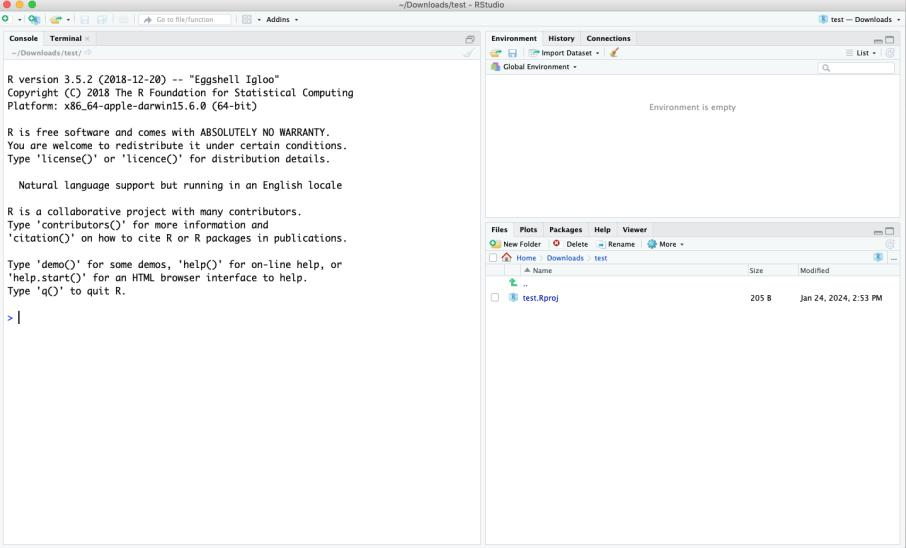
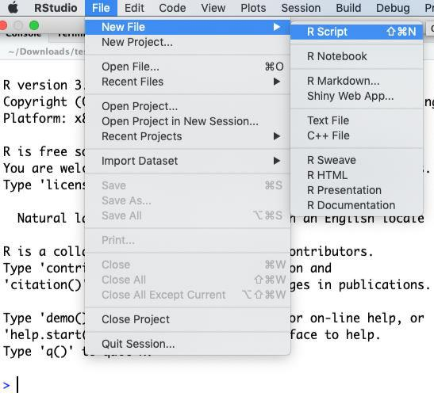
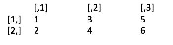

# Week 1 - Exercise

## Week 1 exercises

### 1. Assignment:

-   Spend some more time reading over the assignment brief for the module and
    raise any of your questions with the module coordinator in the lab.
-   Ensure to put the assignment deadline dates in your diary and ensure to note
    the date of the class test – as you will need to take the test in the
    university on the specified day.

### 2. Explore definitions task:

Explore various definitions of the following phrases/terms:

-   Statistics
-   Data science
-   Data analytics
-   Data mining
-   Knowledge discovery
-   Machine learning
-   Algorithms
-   Artificial intelligence

###Definitions: Statistics the practice or science of collecting and analysing
numerical data in large quantities, especially for the purpose of inferring
proportions in a whole from those in a representative sample. "standard error is
a mathematical tool used in statistics to measure variability"

Data science Data science is the study of data to extract meaningful insights
for business. It is a multidisciplinary approach that combines principles and
practices from the fields of mathematics, statistics, artificial intelligence,
and computer engineering to analyze large amounts of data.

Data analytics Data analysis is a process for obtaining raw data, and
subsequently converting it into information useful for decision-making by users.
Data is collected and analyzed to answer questions, test hypotheses, or disprove
theories.

Data mining In simple words, data mining is defined as a process used to extract
usable data from a larger set of any raw data. It implies analysing data
patterns in large batches of data using one or more software. Data mining has
applications in multiple fields, like science and research.

Knowledge discovery Knowledge discovery may be defined as the development of new
tacit or explicit knowledge from data and information or from the synthesis of
prior knowledge. The discovery of new explicit knowledge relies most directly on
combination, whereas the discovery of new tacit knowledge relies most directly
on socialization.

Machine learning the use and development of computer systems that are able to
learn and adapt without following explicit instructions, by using algorithms and
statistical models to analyse and draw inferences from patterns in data. "the
application of machine learning to biological databases has increased"

Algorithms a process or set of rules to be followed in calculations or other
problem-solving operations, especially by a computer. "a basic algorithm for
division"

Artificial intelligence the theory and development of computer systems able to
perform tasks normally requiring human intelligence, such as visual perception,
speech recognition, decision-making, and translation between languages.

What is ‘data quality’ and how can we know if a dataset is of high quality? •
Degree to which data is accurate , complete and fit for purpose

What is data cleaning/data cleansing and how would you go about data
cleaning/data cleansing a new dataset? • the process of fixing or removing
incorrect, corrupted, incorrectly formatted, duplicate, or incomplete data
within a dataset What is meant by ‘downstream tasks’ in data science? • a task
or process that occurs after the completion of an initial or preceding task in a
data pipeline or workflow. Think of an example of how one task can adversely
affect the next task in a data science project? Data scientists face several
challenging problems in their work, including: 1. Data Quality Issues:
Incomplete, inconsistent, or noisy data can significantly hinder analysis.
Cleaning and preprocessing data to ensure its quality is often time-consuming.
2. Feature Selection and Engineering: Identifying the right features to include
in models and transforming raw data into meaningful features requires deep
domain knowledge and creativity. 3. Model Overfitting and Underfitting:
Balancing model complexity to avoid overfitting (where a model learns noise
instead of the underlying pattern) or underfitting (where the model is too
simple to capture the data's complexity) is a common challenge. 4. Scalability:
As datasets grow larger, ensuring that algorithms can scale effectively without
sacrificing performance or accuracy becomes crucial. 5. Interpreting Results:
Communicating findings to stakeholders who may not have a technical background
can be difficult. Data scientists must translate complex analyses into
actionable insights. 6. Keeping Up with Rapidly Evolving Tools and Techniques:
The field of data science is constantly evolving, with new tools, frameworks,
and methodologies emerging regularly. Staying updated is essential but can be
overwhelming. 7. Ethical Considerations: Ensuring that models are fair,
unbiased, and used responsibly is an increasingly important challenge,
especially as data science intersects with sensitive areas like healthcare and
criminal justice. 8. Integration with Business Processes: Aligning data science
projects with business goals and ensuring that insights are actionable within
the organization can be difficult. 9. Collaboration Across Disciplines: Data
scientists often need to work with engineers, business analysts, and other
stakeholders, which can lead to communication challenges and differing
priorities. 10. Deployment and Maintenance: Transitioning models from
development to production involves additional challenges, including monitoring
performance, managing model drift, and ensuring robust infrastructure.
Addressing these challenges requires a combination of technical skills, domain
expertise, and effective communication.

What is the difference between data cleaning/data cleansing and data wrangling?

Either by yourself or in groups, discuss the similarities and differences
between these concepts, and how they relate to each other.

Use Google trends to explore the popularity of these terms:

<https://trends.google.com/trends/>

This video may also be of interest:
<https://www.youtube.com/watch?v=dcXqhMqhZUo> which discusses data science vs.
data analytics and covers a data science lifecycle etc.

### 3. How much data do we create, & what are the trends in data science?

These are key questions. Have a think about how much data our society creates.
You will also be able to read resources such as the following article on how
much data we create: <https://explodingtopics.com/blog/data-generated-per-day>

Have a go at using Google trends to see if there are any particular growing
topics in data science (e.g. deep learning, generative AI, data quality etc.).
There are also online articles such as the following that discuss trends:

<https://explodingtopics.com/blog/data-science-trends>

### 4. Data science lifecycles – how should we manage a data science project?

Review the CRISP-DM lifecycle and consider the data science decisions made.

Review the following papers – in particular figure 2 of the first paper.
Consider comparing and researching the other data science lifecycles mentioned
(e.g. SEMMA, KDD, ASUM-DM etc.).

-   Martínez-Plumed, F., Contreras-Ochando, L., Ferri, C., Hernández-Orallo, J.,
    Kull, M., Lachiche, N., Ramírez-Quintana, M.J. and Flach, P., 2019. CRISP-DM
    twenty years later: From data mining processes to data science trajectories.
    *IEEE Transactions on Knowledge and Data Engineering*, *33*(8),
    pp.3048-3061. <https://ieeexplore.ieee.org/abstract/document/8943998>
-   Schröer, C., Kruse, F. and Gómez, J.M., 2021. A systematic literature review
    on applying CRISP-DM process model. *Procedia Computer Science*, *181*,
    pp.526-534.
    <https://www.sciencedirect.com/science/article/pii/S1877050921002416>

Do also explore the Team Data Science Process Lifecycle:
<https://learn.microsoft.com/en-us/azure/architecture/data-science-process/lifecycle-business-understanding>

### 5. Data quality

In groups or by yourself, explore the following questions:

-   What is 'data quality' and how can we know if a dataset is of high quality?
-   What is data cleaning/data cleansing and how would you go about data
    cleaning/data cleansing a new dataset?
-   What is meant by 'downstream tasks' in data science?
-   Think of an example of how one task can adversely affect the next task in a
    data science project?
-   What is the difference between data cleaning/data cleansing and data
    wrangling?

### 6. eBooks – required reading:

Become familiar with the following books and other resources provided by the
library:

Access <https://www.ulster.ac.uk/library/electronic-resources/e-books> and
select 'O'Reilly Learning (incorporating Safari Books Online)'.

At least review the contents of these 2 books. One is based on R and the other
for Python. You can decide which language you wish to use for the assignment.
However, the module will mostly focus on R. **The class test will only be based
on R.**

-   Lantz, B. (2023) Machine Learning with R, Packt Publishing.
    <https://learning.oreilly.com/library/view/machine-learning-with/9781801071321/>
-   Géron, A. (2022). Hands-on machine learning with Scikit-Learn, Keras, and
    TensorFlow. O'Reilly Media, Inc.
    <https://learning.oreilly.com/library/view/hands-on-machinelearning/9781098125967/>

### 7. R vs. Python

Python is more of a general-purpose language but has a great setup for doing
data science. A data scientist may use Python with Jupyter notebooks on their
own computer or using [Google Colab](https://colab.research.google.com/) for
example.

Whilst Python is more popular (see
<https://insights.stackoverflow.com/survey/2021#most-popular-technologies-language>),
R is a well established language for doing statistics and has a number of
excellent packages. It may be useful to know both.

There are online articles that explore the differences, strengths and weaknesses
of R and Python, which you may want to explore.

Here is one video which you should watch that compares R and Python:

<https://www.youtube.com/watch?v=4lcwTGA7MZw>

You might want to watch the video by John Cook on R:

<https://www.youtube.com/watch?v=6S9r_YbqHy8>

### 8. Refresher in R programming and R studio:

Here, we will use R studio but you can use R in Jupyter notebooks as well.

1.  **Open R Studio, get orientated with R Studio, identify the following:**

<!-- -->

a.  Console.
b.  Workspace and history.
c.  Files, plots, packages and help.
d.  The R script(s) and data view.



2.  Create a Script File and Save it.



3.  **Type the following Code:**

-   Shows the working directory (wd)

```{r, eval=FALSE}
getwd()
```

-   Changes the wd – choose a directory that you wish to work in

```{r, eval=FALSE}
setwd("C:/myfolder/data")
```

## Create a vector – this is like an array:

```{r}
x <- c(3, 5, 10, 4)
```

## Find the length of the vector:

```{r}
length(x)
```

## Calculate the mean and standard deviation:

```{r}
mean(x)
sd(x)
```

## Use the summary function:

```{r}
summary(x)
```

## Take the square root:

```{r}
sqrt(x)
```

## Evaluate the vector using evaluation functions:

### Estimate the output before running code.

```{r}
any(x > 8)
any(x < 8)
all(x > 50)
which(x > 4)
```

## Subset the vector:

### Estimate the output before running code.

```{r}
y <- x[x > 4]
y

y <- x[x > 5 | x == 3]
y
```

### Estimate the output before running code.

## Recode vector elements:

```{r}
x[x > 4] <- 0
x
```

## Try out some arithmetic with vectors:

```{r}
2 + c(6, 0, 9, 20, 22)
3 * c(6, 0, 9, 20, 22)
```

## Understanding *Recycling*:

*Recycling* - R automatically repeats or recycles vectors when necessary

```{r}
x <- c(3, 4, 2)
x + 2
```

R converts this to c(3, 4, 2) + c(2, 2, 2) for you.

```{r}
c(1, 2, 4) + c(6, 0, 9, 20, 22, 11)
```

*Becomes* c(1, 2, 4, 1, 2, 4) + c(6, 0, 9, 20, 22, 11)

## The round function:

```{r}
x <- c(9.5, 16.3, 25.1)
round(x)
```

## Key value pairs

```{r}
x <- c(1, 2, 3)
names(x) <- c("a", "b", "c")
x["b"]
```

The last line should print out 2.

## Explicit coercion or casting

Try each line of code and understand what is happening:

```{r}
x <- c(0:6)
class(x)
as.numeric(x)
as.logical(x)
as.character(x)
```

```{r}
x <- as.character(x)
```

## Nonsensical Coercion

```{r}
x <- c("a", "b", "c")
as.numeric(x)
```

prints out: [1] NA NA NA

Warning message: NAs introduced by coercion

```{r}
as.logical(x)
```

prints out: [1] NA NA NA

## Simulating data in R

Try each line of code. The '?' is a help function that will give you details
about the built in function that you specify. In this case the **rnorm** or
random normalization function which provides a vector of numbers that are
randomly drawn from a probability distribution with a particular mean and SD.

```{r, eval=FALSE}
?rnorm
```

```{r}
x <- rnorm(10)
```

```{r}
x <- rnorm(10, 20, 2)
summary(x)
```

## Setting the seed

This ensures that you can get the same set of random numbers. Ensures
reproducibility.

```{r}
set.seed(1)
rnorm(5)
rnorm(5)
set.seed(1)
rnorm(5)
```

## Bootstrapping

The sample() function allows for bootstrapping, where you can draw a sample from
a vector. You specify what vector you want to sample from and the number of
samples. You can choose to bootstrap/sample with and without replacement. You
can read more online -
[https://en.wikipedia.org/wiki/Bootstrapping\_(statistics)](https://en.wikipedia.org/wiki/Bootstrapping_(statistics))

```{r}
set.seed(1)
```

```{r, eval=FALSE}
?sample
```

```{r}
sample(c(1:10), 4)
sample(c(1:10), 10, replace = TRUE)
```

## Matrices

Matrices are 2 dimensional vectors (or 2D arrays)

```{r}
m <- matrix(c(1, 2, 3, 4, 5, 6), nrow = 2, ncol = 3)
m
```

Should print out: 

Try the following code, line by line:

```{r}
dim(m)
nrow(m)
ncol(m)
colnames(m) <- c('a', 'b', 'c')
m[,'b']
m[2,2]
m[,2]
m[1,]
m[,1:2]
```

10. **To explore more of R, walkthrough the following tutorial:**
    <https://www.w3schools.com/r/default.asp>

11. **Read and explore chapter 2 in the following book (perhaps outside of the
    lab):**

-   Lantz, B. (2023) Machine Learning with R, Packt Publishing.
    <https://learning.oreilly.com/library/view/machine-learning-with/9781801071321/>
