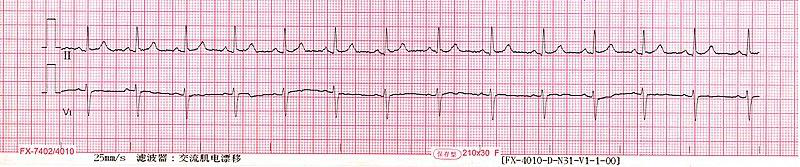
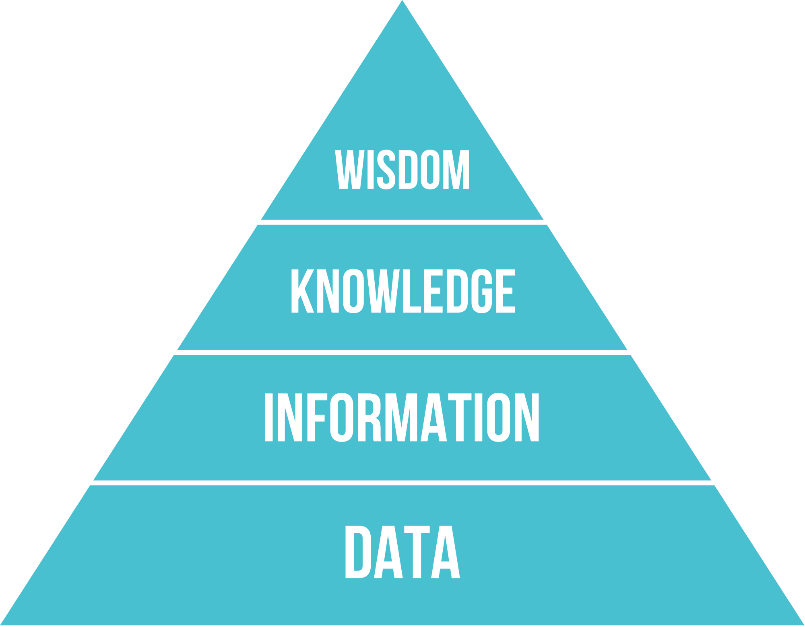
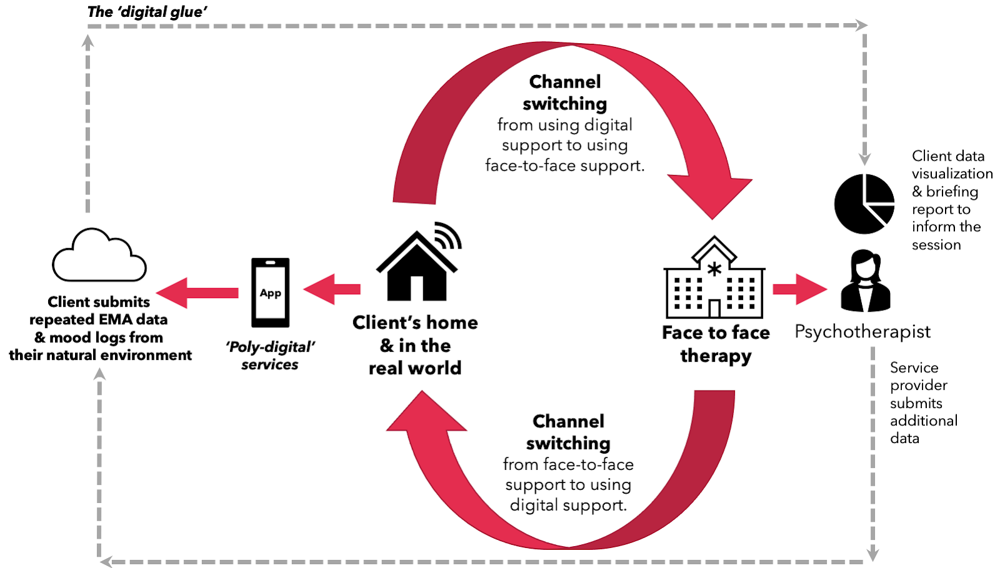
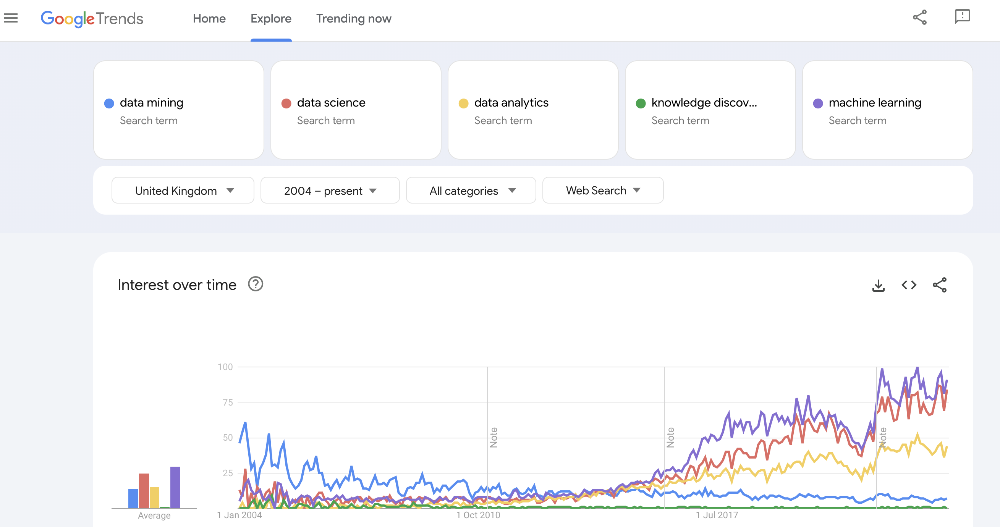
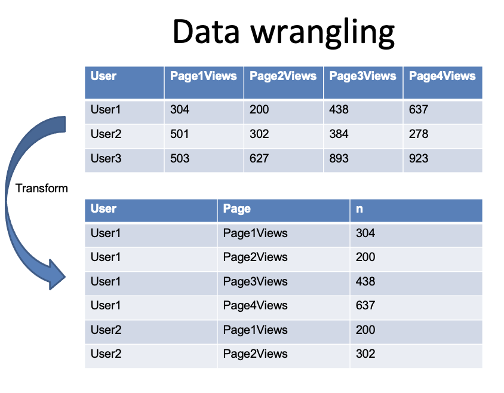
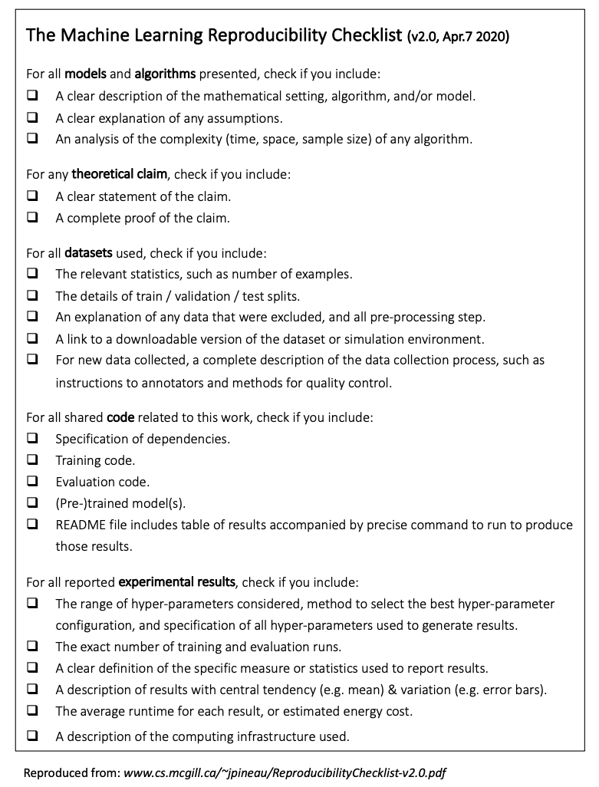
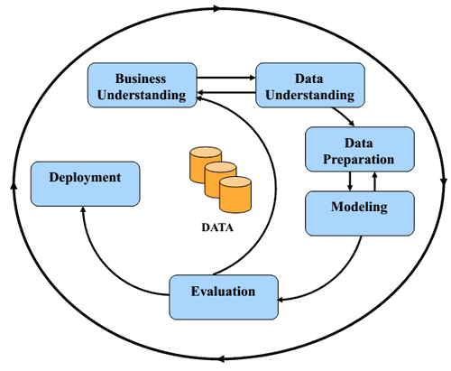

```{r setup, include=FALSE}
knitr::opts_chunk$set(echo = TRUE)
```

# Week 1 - Introduction to Data Science

## Books – required reading

- Lantz, B. (2023) Machine Learning with R, Packt Publishing.
    - [https://learning.oreilly.com/library/view/machine-learning-with/9781801071321/](https://learning.oreilly.com/library/view/machine-learning-with/9781801071321/)
- Géron, A. (2022). Hands-on machine learning with Scikit-Learn, Keras, and TensorFlow. O'Reilly Media, Inc.
    - [https://learning.oreilly.com/library/view/hands-on-machinelearning/9781098125967/](https://learning.oreilly.com/library/view/hands-on-machinelearning/9781098125967/)

### How much data do we create?

“328.77 million terabytes per day”

*90% of data was created in the last 2 years** 
[**https://explodingtopics.com/blog/data-generated-per-day**](https://explodingtopics.com/blog/data-generated-per-day)

### ‘Big Data’

- Volume
- Velocity
- Variety
- Veracity

Do you have big data? Really?

It might look big, but you may not have enough rows to provide sufficient variance given the number of variables. Consider 20 Boolean variables – how many rows would you need to represent the possible number of permutations?

$$2^{20} = 1,048,576$$

### Do I have enough data for my project?

Depends: could be based on the number of variables/features, number of outputs/classes…

1 in 10 rule…. for regression?

1000 lecimages/images for each class… for computer vision?

[https://machinelearningmastery.com/much-training-data-required-machine-learning/](https://machinelearningmastery.com/much-training-data-required-machine-learning/)

[https://towardsdatascience.com/how-do-you-know-you-have-enough-training-data-ad9b1fd679ee](https://towardsdatascience.com/how-do-you-know-you-have-enough-training-data-ad9b1fd679ee)

[https://petewarden.com/2017/12/14/how-many-lecimages/images-do-you-need-to-train-a-neural-network/](https://petewarden.com/2017/12/14/how-many-lecimages/images-do-you-need-to-train-a-neural-network/)

The "one in ten rule" in statistics is a simple guideline for regression analysis that helps prevent overfitting. It states:

For every predictive variable (feature) you want to include in your model, you should have at least 10 events in your data.

For example:

- In logistic regression, if your less common outcome occurs 30 times, you should use no more than 3 predictive variables
- In survival analysis, if you have 50 uncensored events (like deaths), you should limit yourself to 5 predictors

If you violate this rule by including too many variables, your model may fit your current data well but will likely perform poorly on new data because it's capturing random noise rather than true relationships.

This rule is often violated in fields like genomics where researchers might analyze thousands of genes with relatively few patients, leading to questionable findings.

> *“the future of big data* *is small data”*
> 

Kokol, P., Kokol, M. and Zagoranski, S., 2022. Machine learning on small size samples: A synthetic knowledge synthesis. *Science Progress*, *105*(1), p.00368504211029777.

## Questions

What is data? (What are data? Datum is the singular)

What is data analytics?

Why is data analytics important?

 view). The stick is notched and inscribed to record a debt owed to the [rural dean](https://en.wikipedia.org/wiki/Rural_dean) of [Preston Candover](https://en.wikipedia.org/wiki/Preston_Candover), Hampshire, of a [tithe](https://en.wikipedia.org/wiki/Tithe) of 20[d](https://en.wikipedia.org/wiki/Penny_(British_pre-decimal_coin)) each on 32 sheep, amounting to a total sum of £2 13s. 4d.   ](lecimages/image1.png)

By Winchester City Council Museums - Flickr, CC BY-SA 2.0, https://commons.wikimedia.org/w/index.php?curid=39255824
"Medieval tally stick" ([front and reverse](https://en.wikipedia.org/wiki/Obverse_and_reverse) view). The stick is notched and inscribed to record a debt owed to the [rural dean](https://en.wikipedia.org/wiki/Rural_dean) of [Preston Candover](https://en.wikipedia.org/wiki/Preston_Candover), Hampshire, of a [tithe](https://en.wikipedia.org/wiki/Tithe) of 20[d](https://en.wikipedia.org/wiki/Penny_(British_pre-decimal_coin)) each on 32 sheep, amounting to a total sum of £2 13s. 4d.

| User  | Variable 1 | Variable 2 | Variable 3 | Variable 4 |
|-------|------------|------------|------------|------------|
| User1 | 304        | 200        | 438        | 637        |
| User2 | 501        | 302        | 384        | 278        |
| User3 | 503        | 627        | 893        | 923        |

Instances / rows

Columns/variables are also typically called features or attributes….

### Types of variables

- Categorical / nominal / *factors*
- Strings
- Numeric
- Continuous (eg. time and distance)
- Discrete (Categorical - number of people in a lecture - whole number)
- …

0-255 (1 byte) lecimages/Images - greyscale lecimages/image one pixel = 1 byte

ECG / time series – an array of numbers/amplitudes



Ptrump16, CC BY-SA 4.0 <https://creativecommons.org/licenses/by-sa/4.0>, via Wikimedia Commons

DIKW Pyramid 

Why is data analytics important?



## Industry 4.0

*” [https://commons.wikimedia.org/wiki/File:Industry_4.0.png](https://commons.wikimedia.org/wiki/File:Industry_4.0.png)](lecimages/image6.png)

Credit "*Christoph Roser at [AllAboutLean.com](http://www.allaboutlean.com/)*" [https://commons.wikimedia.org/wiki/File:Industry_4.0.png](https://commons.wikimedia.org/wiki/File:Industry_4.0.png)

4th: More data is generated by sensors and devices

4th: Data is needed for AI algorithms

### **Data is the new Oil…** or is it?

Value of data in services –mental health case study



Bond, R.R., Mulvenna, M.D., Potts, C., O’Neill, S., Ennis, E. and Torous, J., 2023. Digital transformation of mental health services. *npj Mental Health Research*, *2*(1), p.13.

## Case Study - Ulster research Application: Helpline caller analytics

**Caller Characteristics/features:**

1. Number of calls
2. Mean call duration
3. Standard deviation of call durations

**4 Steps: Data Preparation for Clustering analysis**:

1. Derived a new data set: **61,287 callers**/61,287 rows with these 3 features
2. Feature standardisation (important that each feature is metric agnostic so there is no bias)
3. Choose k
4. Apply the K-means clustering technique

> *O’Neill, S., Bond, R.R., Grigorash, A., Ramsey, C., Armour, C. and Mulvenna, M.D., 2019. Data analytics of call log data to identify caller behaviour patterns from a mental health and well-being helpline. Health informatics journal, 25(4), pp.1722-1738.*
> 

## Useful and Actionable Insights!

### A new paradigm for science:

- Conventional scientists
    - Prospective studies with a single hypothesis
- Big data scientists
    - Retrospective data mining
    - Looking for patterns without a particular hunch
    - Hypothesis free?

### Confused about Nomenclature?

Artificial Intelligence

Computational Intelligence

Intelligent Systems

Data Analytics

Data Mining

Data Science

Data Wrangling

Big Data

Machine Learning

Algorithms

Business Intelligence

**Artificial Intelligence (AI)**: The simulation of human intelligence in machines programmed to think and learn like humans, performing tasks that typically require human intelligence.

**Computational Intelligence**: A set of nature-inspired computational approaches to address complex problems, including neural networks, fuzzy systems, and evolutionary computation.

**Intelligent Systems**: Computer systems designed to emulate aspects of human intelligence, capable of sensing, reasoning, learning, and acting autonomously.

**Data Analytics**: The process of examining datasets to draw conclusions about the information they contain, using specialized systems and software.

**Data Mining**: The practice of examining large databases to generate new information and identify patterns using statistical methods, machine learning, and database systems.

**Data Science**: An interdisciplinary field that uses scientific methods, processes, algorithms, and systems to extract knowledge and insights from structured and unstructured data.

**Data Wrangling**: The process of cleaning, structuring, and enriching raw data into a desired format for better decision-making and analysis.

**Big Data**: Extremely large datasets that may be analyzed computationally to reveal patterns, trends, and associations, especially relating to human behavior and interactions.

**Machine Learning**: A subset of AI that provides systems the ability to automatically learn and improve from experience without being explicitly programmed.

**Algorithms**: A step-by-step procedure or formula for solving a problem or accomplishing a task, often used in data processing, calculation, and automated reasoning.

**Business Intelligence**: Strategies and technologies used by enterprises for data analysis of business information, providing historical, current, and predictive views of business operations.

> Statistical modeling, signal processing, feature Business Analytics engineering, statistical computing, statistical learning, pattern recognition, computer vision…

### **Task**

Explore various definitions of the following phrases/terms:

- Statistics
- Data science
- Data analytics
- Data mining
- Knowledge discovery
- Machine learning
- Algorithms
- Artificial intelligence

Here are brief definitions of each term:

**Statistics**: The science of collecting, analyzing, interpreting, and presenting data to identify patterns and trends.

**Data Science**: An interdisciplinary field using scientific methods, algorithms, and systems to extract knowledge and insights from structured and unstructured data.

**Data Analytics**: The process of examining datasets to draw conclusions about the information they contain using specialized tools and techniques.

**Data Mining**: The practice of examining large databases to discover patterns and generate new information using automated methods.

**Knowledge Discovery**: The process of identifying valid, novel, potentially useful, and ultimately understandable patterns in data.

**Machine Learning**: A subset of AI enabling systems to learn and improve from experience without explicit programming.

**Algorithms**: Step-by-step procedures or formulas designed to solve problems or perform specific tasks.

**Artificial Intelligence**: The development of computer systems able to perform tasks that typically require human intelligence.



# Statistical modelling vs. Machine learning

## Understanding vs. Prediction

### Types of data

- Structured data
    - SQL Database
    - Excel spreadsheet / CSV file
- Unstructured data
    - Free text responses
    - Emails / social media
    - Text files
    - Doctor’s notes

### How much unstructured data do we have?

80% - 90%?

> [https://www.mongodb.com/unstructured-data#:~:text=From%2080%25%20to%2090%25%20of,used%20to%20guide%20business%20decisions](https://www.mongodb.com/unstructured-data)
> 

## Typical data structures

### **Typical datasets**

- Comma separated values (CSV)
- eXtensible Markup Language (XML)
- JavaScript Object Notation (JSON)
    - Nested JSON in CSV structures
- SQL
- Excel data formats
- Other: .txt files for text, or RGB data for lecimages/images etc.
- **Other terms associated with formats:**
    - Vectors
    - Matrices
    - Data frames

Wide and long data formats

| User  | Page1Views | Page2Views | Page3Views | Page4Views |
|-------|------------|------------|------------|------------|
| User1 | 304        | 200        | 438        | 637        |
| User2 | 501        | 302        | 384        | 278        |
| User3 | 503        | 627        | 893        | 923        |

| User  | Page       | n   |
|-------|------------|-----|
| User1 | Page1Views | 304 |
| User1 | Page2Views | 200 |
| User1 | Page3Views | 438 |
| User1 | Page4Views | 637 |
| User2 | Page1Views | 200 |
| User2 | Page2Views | 302 |



### Open data

- Free to the world to download
- Provides analysis at scale
- Caveat is that
    - It can dominate data science projects
    - Data can be ‘overanalysed’
    - What about data provenance?
    - What about data quality?

**Also having open data does not necessarily mean that it is easily accessible data!**

---

- Kaggle
- UCI
- Open data NI
- PhysioNet
- …

## Problem with health data science

> *"It’s easy to let ourselves be driven by what we can do with the data, rather than by the most pressing clinical need. We see many AI solutions addressing the same tasks, because those are the tasks for which the data are available."*
> 

Bethany Percha, Mount Sinai Health System

[https://eithealth.eu/wp-content/uploads/2020/03/EIT-Health-and-McKinsey_Transforming-Healthcare-with-AI.pdf](https://eithealth.eu/wp-content/uploads/2020/03/EIT-Health-and-McKinsey_Transforming-Healthcare-with-AI.pdf)

## Qualitative and Quantitative

- Quantitative data
    - Numbers, numbers, numbers
        - Temperature
        - Heart rate
        - Likert ratings
- Qualitative data
    - Text
        - Surveys
        - Interviews
        - App comments / user feedback

Mixed methods?

- Quantitative analysis
    - Quantitative statistical analysis
        - Descriptive statistics: Mean and SD
        - Inferential Statistics: t-tests
- Qualitative analysis
    - Thematic analysis
    - Advanced methods:
        - Text analytics
            - word embeddings
        - Review mining

## What is a data scientist?

1. Statistics
2. Machine learning
3. Programming

### Data science is not just about ML

Many other non-ML topics:

- Data wrangling, cleaning etc.
- EDA – descriptive and inferential statistics (T Tests)
- Data visualization and visual analytics
- Time series analysis
- Modelling
- Text analytics
- Process mining… …


## Observations

- Lack of decision support tools for practicing data scientists
- Every data scientist will likely have their own pipeline and personal preferences
- Not all data science decisions will always be clearly documented

> Cockburn A, Dragicevic P, Besançon L, Gutwin C. **Threats of a replication crisis in empirical computer science.** Communications of the ACM. 2020 Jul 22;63(8):70-9.
> 
- Leading to reproducibility problems
    - *“70% of researchers have tried and failed to reproduce another scientist's* *experiments”*
        - [https://www.nature.com/news/1-500-scientists-lift-the-lid-on-reproducibility-1.19970](https://www.nature.com/news/1-500-scientists-lift-the-lid-on-reproducibility-1.19970)
- 3 types of reproducibility problems (Goodman, 2016):
    - methods, results, and inferential reproducibility

> Goodman, S.N., Fanelli, D. and Ioannidis, J.P., 2016. What does research reproducibility mean?. *Science translational medicine*, *8*(341), pp.341ps12-341ps12.
> 

> Cockburn A, Dragicevic P, Besançon L, Gutwin C. **Threats of a replication crisis in empirical computer science.** Communications of the ACM. 2020 Jul 22;63(8):70-9.
> 

Data Science Checklists



Reproducibility Checklist

https://www.cs.mcgill.ca/~jpineau/ReproducibilityChecklist.pdf

Pre-ML Checklist

https://services.google.com/fh/files/blogs/data-prep-checklist-ml-bd-wp-v2.pdf


> Kolodner, J.L., 2002. The "neat" and the "scruffy" in promoting learning from analogy: We need to pay attention to both. *The Journal of the learning Sciences*, *11*(1), pp.139-152.
> 

## Gartner Analytic Continuum

- Descriptive analytics
- Diagnostic analytics
- Predictive analytics
- Prescriptive analytics

[https://www.argility.com/argility-ecosystem-solutions/industry-4-0/predictive-prescriptive-analytics/](https://www.argility.com/argility-ecosystem-solutions/industry-4-0/predictive-prescriptive-analytics/)


## Data mining/analytics/science

- Anomaly detection
- Association rule learning
- Clustering
- Classification
- Regression
- Summarization

> [Fayyad, Usama](https://en.wikipedia.org/wiki/Usama_Fayyad); [Piatetsky-Shapiro, Gregory](https://en.wikipedia.org/wiki/Gregory_Piatetsky-Shapiro); Smyth, Padhraic (1996). ["From Data Mining to Knowledge Discovery in Databases"](http://www.kdnuggets.com/gpspubs/aimag-kdd-overview-1996-Fayyad.pdf)(PDF). Retrieved 17 December 2008.
> 

Workflow:

[https://en.wikipedia.org/wiki/Cross-industry_standard_process_for_data_mining](https://en.wikipedia.org/wiki/Cross-industry_standard_process_for_data_mining)



### CRISP-DM Cross-industry standard process for data mining

- Six phases:
    - Business understanding
    - Data understanding
    - Data preparation
    - Modeling
    - Evaluation
    - Deployment

### knowledge discovery in databases (KDD)

- *5 stages:*
    - Selection
    - Pre-processing
    - Transformation
    - *Data mining*
    - Interpretation/evaluation

### Typical Data Analytics Processes

- Data gathering, data wrangling, data cleansing  and data linking
- Exploratory data analysis (EDA)
    - Data visualization
    - Clustering/Association mining
- Supervised Machine learning
    - Feature engineering (feature extraction/feature selection)
    - Model building
    - Model optimization
    - Model evaluation

### Data cleaning/wrangling

**80% : 20% ?**

> Akin to Pareto’s law
> 
> [https://medium.com/analytics-vidhya/a-data-cleaning-journey-2b0146407e44#](https://medium.com/analytics-vidhya/a-data-cleaning-journey-2b0146407e44)


Data wrangling example scenarios

- Data linking / merging different datasets into one
- Transforming a dataset from JSON to CSV
- Combining variables
- Discretizing variables (age > age groups)
- Data imputation for missing variables
- Cleaning variables
- Check data quality
- …

### Data cleaning example

>Male
> 
>m
> 
>Female
> 
>MALE
> 
>M
> 
>F
> 
>f
> 
>male
> 
>FEMALE
> 
>fem
> 
>Mal
> 
>…

# Introduction to R

## Resources

- BOOK: The Art of R Programming
- http://www.statmethods.net

## What is R and its history?

- Statistical computing
- Developed by John Chambers at Bell Labs

SPSS vs. R

R vs. Python

## Computer Programming Paradigms

- Procedural Programming
- Object Oriented Programming
- **Functional Programming**

> *“Functional Programming is when functions …are used as the fundamental building blocks of a program.”*
> 

c2.com/cgi/wiki?FunctionalProgramming

## RAM needed

- CSV file with 1,500,000 rows and 120 columns, each cell being a number.
    
    
    

[https://en.wikipedia.org/wiki/Double-precision_floating-point_format](https://en.wikipedia.org/wiki/Double-precision_floating-point_format)

- Some people use R for only it’s built in functions

```r
x <- c(1,5,3)
mean(x)
```

- Some people program custom functions

```r
f <- function(a, b) {
	y <- a*b
	return(y)
}
f(2,3)
```

## R has 5 basic or “atomic” classes of objects (modes)

1. character
2. numeric
3. integer
4. complex
5. logical (True/False)

### The most basic object is a vector

- A vector can only contain objects of the same class/mode
- The one exception is a *list*, which is represented as a vector but can contain objects of different classes
- Empty vectors can be created with the `vector()` function.

### Vectors

```r
x <- c(0.5, 0.6) ## numeric
x <- c(TRUE, FALSE) ## logical
x <- c(T, F) ## logical
x <- c("a", "b", "c") ## character
x <- c(1,2,3) ## integer
x <- c(1+0i, 2+4i) ## complex
```

### THE **:** OPERATOR

```r
x <- c(1:20)
```

```r
x <- c(1,2,3,4,5,6,7,8,9,10,11,12,13,14,15,16,17,18,19,20)
```

### Vector() method

```r
y <- vector(length=2)
```

```r
y[1] <- 3
y[2] <- 8
```

> Note: vectors are not 0 based
>