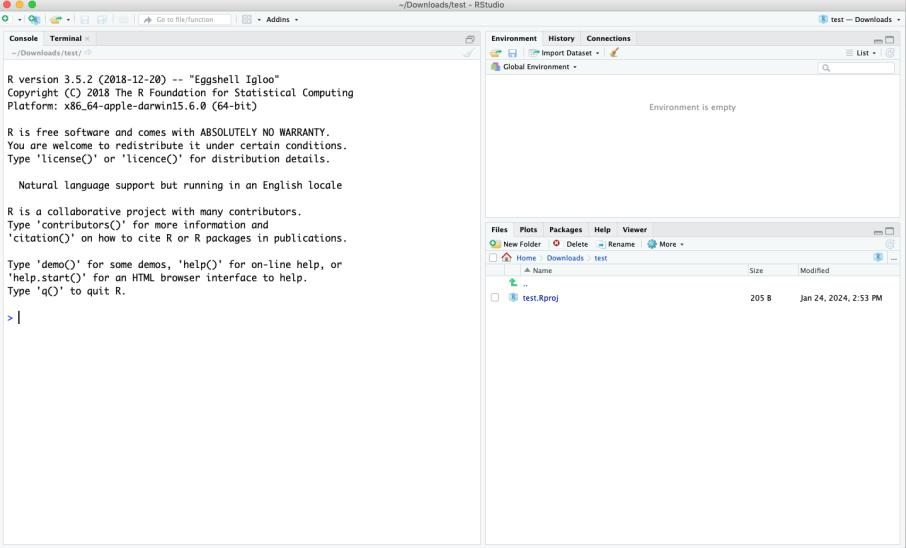
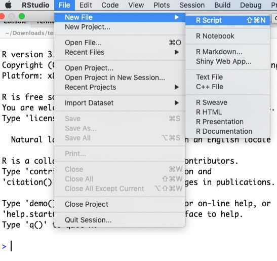

Week 1 - Exercise
================

# Week 1 - Exercise

## Week 1 exercises

### 1. Assignment:

- Spend some more time reading over the assignment brief for the module
  and raise any of your questions with the module coordinator in the
  lab.
- Ensure to put the assignment deadline dates in your diary and ensure
  to note the date of the class test – as you will need to take the test
  in the university on the specified day.

### 2. Explore definitions task:

Explore various definitions of the following phrases/terms:

- Statistics
- Data science
- Data analytics
- Data mining
- Knowledge discovery
- Machine learning
- Algorithms
- Artificial intelligence

Either by yourself or in groups, discuss the similarities and
differences between these concepts, and how they relate to each other.

Use Google trends to explore the popularity of these terms:

<https://trends.google.com/trends/>

This video may also be of interest:
<https://www.youtube.com/watch?v=dcXqhMqhZUo> which discusses data
science vs. data analytics and covers a data science lifecycle etc.

### 3. How much data do we create, & what are the trends in data science?

These are key questions. Have a think about how much data our society
creates. You will also be able to read resources such as the following
article on how much data we create:
<https://explodingtopics.com/blog/data-generated-per-day>

Have a go at using Google trends to see if there are any particular
growing topics in data science (e.g. deep learning, generative AI, data
quality etc.). There are also online articles such as the following that
discuss trends:

<https://explodingtopics.com/blog/data-science-trends>

### 4. Data science lifecycles – how should we manage a data science project?

Review the CRISP-DM lifecycle and consider the data science decisions
made.

Review the following papers – in particular figure 2 of the first paper.
Consider comparing and researching the other data science lifecycles
mentioned (e.g. SEMMA, KDD, ASUM-DM etc.).

- Martínez-Plumed, F., Contreras-Ochando, L., Ferri, C.,
  Hernández-Orallo, J., Kull, M., Lachiche, N., Ramírez-Quintana, M.J.
  and Flach, P., 2019. CRISP-DM twenty years later: From data mining
  processes to data science trajectories. *IEEE Transactions on
  Knowledge and Data Engineering*, *33*(8), pp.3048-3061.
  <https://ieeexplore.ieee.org/abstract/document/8943998>
- Schröer, C., Kruse, F. and Gómez, J.M., 2021. A systematic literature
  review on applying CRISP-DM process model. *Procedia Computer
  Science*, *181*, pp.526-534.
  <https://www.sciencedirect.com/science/article/pii/S1877050921002416>

Do also explore the Team Data Science Process Lifecycle:
<https://learn.microsoft.com/en-us/azure/architecture/data-science-process/lifecycle-business-understanding>

### 5. Data quality

In groups or by yourself, explore the following questions:

- What is ‘data quality’ and how can we know if a dataset is of high
  quality?
- What is data cleaning/data cleansing and how would you go about data
  cleaning/data cleansing a new dataset?
- What is meant by ‘downstream tasks’ in data science?
- Think of an example of how one task can adversely affect the next task
  in a data science project?
- What is the difference between data cleaning/data cleansing and data
  wrangling?

### 6. eBooks – required reading:

Become familiar with the following books and other resources provided by
the library:

Access <https://www.ulster.ac.uk/library/electronic-resources/e-books>
and select ‘O’Reilly Learning (incorporating Safari Books Online)’.

At least review the contents of these 2 books. One is based on R and the
other for Python. You can decide which language you wish to use for the
assignment. However, the module will mostly focus on R. **The class test
will only be based on R.**

- Lantz, B. (2023) Machine Learning with R, Packt Publishing.
  <https://learning.oreilly.com/library/view/machine-learning-with/9781801071321/>
- Géron, A. (2022). Hands-on machine learning with Scikit-Learn, Keras,
  and TensorFlow. O’Reilly Media,
  Inc. <https://learning.oreilly.com/library/view/hands-on-machinelearning/9781098125967/>

### 7. R vs. Python

Python is more of a general-purpose language but has a great setup for
doing data science. A data scientist may use Python with Jupyter
notebooks on their own computer or using [Google
Colab](https://colab.research.google.com/) for example.

Whilst Python is more popular (see
<https://insights.stackoverflow.com/survey/2021#most-popular-technologies-language>),
R is a well established language for doing statistics and has a number
of excellent packages. It may be useful to know both.

There are online articles that explore the differences, strengths and
weaknesses of R and Python, which you may want to explore.

Here is one video which you should watch that compares R and Python:

<https://www.youtube.com/watch?v=4lcwTGA7MZw>

You might want to watch the video by John Cook on R:

<https://www.youtube.com/watch?v=6S9r_YbqHy8>

### 8. Refresher in R programming and R studio:

Here, we will use R studio but you can use R in Jupyter notebooks as
well.

1.  **Open R Studio, get orientated with R Studio, identify the
    following:**

<!-- -->

1.  Console.
2.  Workspace and history.
3.  Files, plots, packages and help.
4.  The R script(s) and data view.

<figure>

<figcaption aria-hidden="true">RStudio Interface</figcaption>
</figure>

2.  Create a Script File and Save it.

<figure>

<figcaption aria-hidden="true">Creating a script file</figcaption>
</figure>

3.  **Type the following Code:**

- Shows the working directory (wd)

``` r
getwd()
```

- Changes the wd – choose a directory that you wish to work in

``` r
setwd("C:/myfolder/data")
```

## Create a vector – this is like an array:

``` r
x <- c(3, 5, 10, 4)
```

## Find the length of the vector:

``` r
length(x)
```

    ## [1] 4

## Calculate the mean and standard deviation:

``` r
mean(x)
```

    ## [1] 5.5

``` r
sd(x)
```

    ## [1] 3.109126

## Use the summary function:

``` r
summary(x)
```

    ##    Min. 1st Qu.  Median    Mean 3rd Qu.    Max. 
    ##    3.00    3.75    4.50    5.50    6.25   10.00

## Take the square root:

``` r
sqrt(x)
```

    ## [1] 1.732051 2.236068 3.162278 2.000000

## Evaluate the vector using evaluation functions:

### Estimate the output before running code.

``` r
any(x > 8)
```

    ## [1] TRUE

``` r
any(x < 8)
```

    ## [1] TRUE

``` r
all(x > 50)
```

    ## [1] FALSE

``` r
which(x > 4)
```

    ## [1] 2 3

## Subset the vector:

### Estimate the output before running code.

``` r
y <- x[x > 4]
y
```

    ## [1]  5 10

``` r
y <- x[x > 5 | x == 3]
y
```

    ## [1]  3 10

### Estimate the output before running code.

## Recode vector elements:

``` r
x[x > 4] <- 0
x
```

    ## [1] 3 0 0 4

## Try out some arithmetic with vectors:

``` r
2 + c(6, 0, 9, 20, 22)
```

    ## [1]  8  2 11 22 24

``` r
3 * c(6, 0, 9, 20, 22)
```

    ## [1] 18  0 27 60 66

## Understanding *Recycling*:

*Recycling* - R automatically repeats or recycles vectors when necessary

``` r
x <- c(3, 4, 2)
x + 2
```

    ## [1] 5 6 4

R converts this to c(3, 4, 2) + c(2, 2, 2) for you.

``` r
c(1, 2, 4) + c(6, 0, 9, 20, 22, 11)
```

    ## [1]  7  2 13 21 24 15

*Becomes* c(1, 2, 4, 1, 2, 4) + c(6, 0, 9, 20, 22, 11)

## The round function:

``` r
x <- c(9.5, 16.3, 25.1)
round(x)
```

    ## [1] 10 16 25

## Key value pairs

``` r
x <- c(1, 2, 3)
names(x) <- c("a", "b", "c")
x["b"]
```

    ## b 
    ## 2

The last line should print out 2.

## Explicit coercion or casting

Try each line of code and understand what is happening:

``` r
x <- c(0:6)
class(x)
```

    ## [1] "integer"

``` r
as.numeric(x)
```

    ## [1] 0 1 2 3 4 5 6

``` r
as.logical(x)
```

    ## [1] FALSE  TRUE  TRUE  TRUE  TRUE  TRUE  TRUE

``` r
as.character(x)
```

    ## [1] "0" "1" "2" "3" "4" "5" "6"

``` r
x <- as.character(x)
```

## Nonsensical Coercion

``` r
x <- c("a", "b", "c")
as.numeric(x)
```

    ## Warning: NAs introduced by coercion

    ## [1] NA NA NA

prints out: \[1\] NA NA NA

Warning message: NAs introduced by coercion

``` r
as.logical(x)
```

    ## [1] NA NA NA

prints out: \[1\] NA NA NA

## Simulating data in R

Try each line of code. The ‘?’ is a help function that will give you
details about the built in function that you specify. In this case the
**rnorm** or random normalization function which provides a vector of
numbers that are randomly drawn from a probability distribution with a
particular mean and SD.

``` r
?rnorm
```

``` r
x <- rnorm(10)
```

``` r
x <- rnorm(10, 20, 2)
summary(x)
```

    ##    Min. 1st Qu.  Median    Mean 3rd Qu.    Max. 
    ##   17.31   19.40   20.16   20.14   20.92   23.59

## Setting the seed

This ensures that you can get the same set of random numbers. Ensures
reproducibility.

``` r
set.seed(1)
rnorm(5)
```

    ## [1] -0.6264538  0.1836433 -0.8356286  1.5952808  0.3295078

``` r
rnorm(5)
```

    ## [1] -0.8204684  0.4874291  0.7383247  0.5757814 -0.3053884

``` r
set.seed(1)
rnorm(5)
```

    ## [1] -0.6264538  0.1836433 -0.8356286  1.5952808  0.3295078

## Bootstrapping

The sample() function allows for bootstrapping, where you can draw a
sample from a vector. You specify what vector you want to sample from
and the number of samples. You can choose to bootstrap/sample with and
without replacement. You can read more online -
<https://en.wikipedia.org/wiki/Bootstrapping_(statistics)>

``` r
set.seed(1)
```

``` r
?sample
```

``` r
sample(c(1:10), 4)
```

    ## [1] 9 4 7 1

``` r
sample(c(1:10), 10, replace = TRUE)
```

    ##  [1]  2  7  2  3  1  5  5 10  6 10

## Matrices

Matrices are 2 dimensional vectors (or 2D arrays)

``` r
m <- matrix(c(1, 2, 3, 4, 5, 6), nrow = 2, ncol = 3)
m
```

    ##      [,1] [,2] [,3]
    ## [1,]    1    3    5
    ## [2,]    2    4    6

Should print out: 

Try the following code, line by line:

``` r
dim(m)
```

    ## [1] 2 3

``` r
nrow(m)
```

    ## [1] 2

``` r
ncol(m)
```

    ## [1] 3

``` r
colnames(m) <- c('a', 'b', 'c')
m[,'b']
```

    ## [1] 3 4

``` r
m[2,2]
```

    ## b 
    ## 4

``` r
m[,2]
```

    ## [1] 3 4

``` r
m[1,]
```

    ## a b c 
    ## 1 3 5

``` r
m[,1:2]
```

    ##      a b
    ## [1,] 1 3
    ## [2,] 2 4

10. **To explore more of R, walkthrough the following tutorial:**
    <https://www.w3schools.com/r/default.asp>

11. **Read and explore chapter 2 in the following book (perhaps outside
    of the lab):**

- Lantz, B. (2023) Machine Learning with R, Packt Publishing.
  <https://learning.oreilly.com/library/view/machine-learning-with/9781801071321/>
