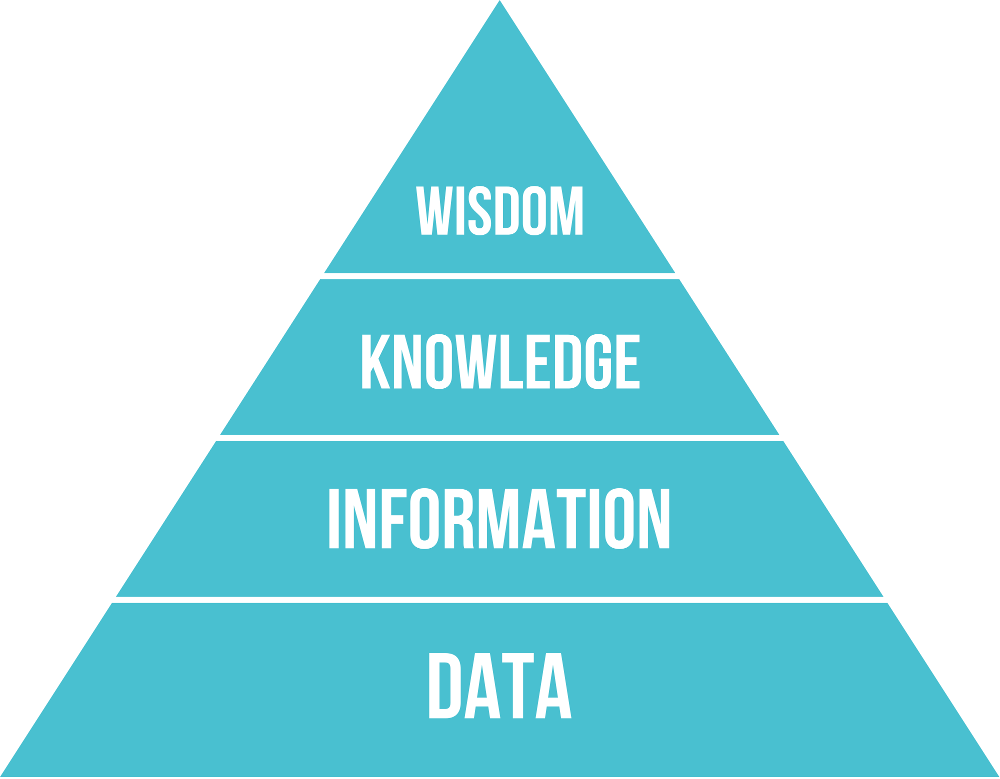
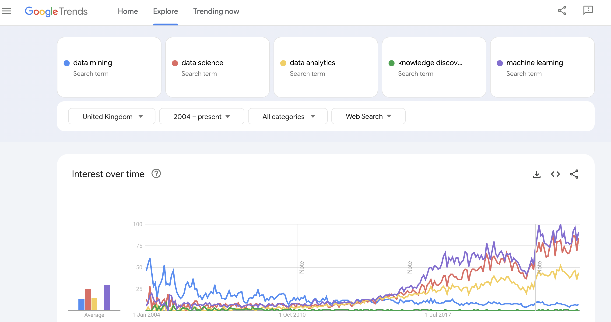
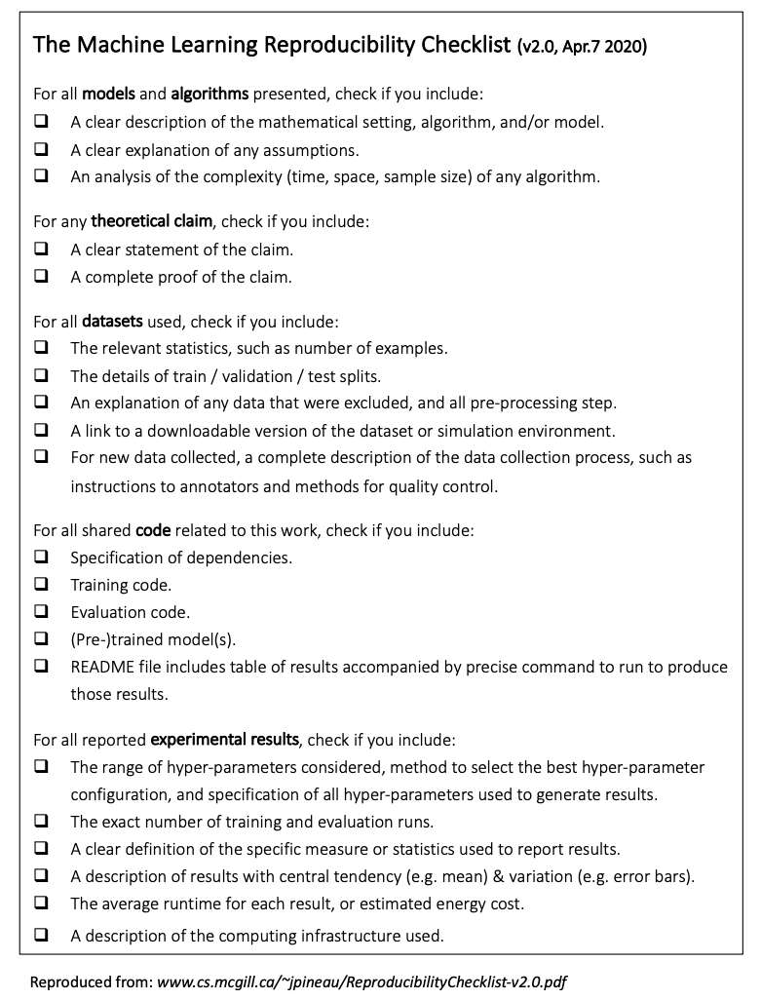
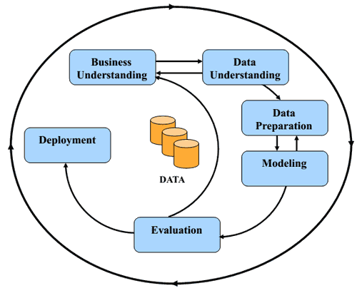

Week 1 - Introduction to Data Science
================

# Week 1 - Introduction to Data Science

## Books – required reading

- Lantz, B. (2023) Machine Learning with R, Packt Publishing.
  - <https://learning.oreilly.com/library/view/machine-learning-with/9781801071321/>
- Géron, A. (2022). Hands-on machine learning with Scikit-Learn, Keras,
  and TensorFlow. O’Reilly Media, Inc.
  - <https://learning.oreilly.com/library/view/hands-on-machinelearning/9781098125967/>

### How much data do we create?

“328.77 million terabytes per day”

\*90% of data was created in the last 2 years\*\*
[**https://explodingtopics.com/blog/data-generated-per-day**](https://explodingtopics.com/blog/data-generated-per-day)

### ‘Big Data’

- Volume
- Velocity
- Variety
- Veracity

Do you have big data? Really?

It might look big, but you may not have enough rows to provide
sufficient variance given the number of variables. Consider 20 Boolean
variables – how many rows would you need to represent the possible
number of permutations?

$$2^{20} = 1,048,576$$

### Do I have enough data for my project?

Depends: could be based on the number of variables/features, number of
outputs/classes…

1 in 10 rule…. for regression?

1000 lecimages/images for each class… for computer vision?

<https://machinelearningmastery.com/much-training-data-required-machine-learning/>

<https://towardsdatascience.com/how-do-you-know-you-have-enough-training-data-ad9b1fd679ee>

<https://petewarden.com/2017/12/14/how-many-lecimages/images-do-you-need-to-train-a-neural-network/>

The “one in ten rule” in statistics is a simple guideline for regression
analysis that helps prevent overfitting. It states:

For every predictive variable (feature) you want to include in your
model, you should have at least 10 events in your data.

For example:

- In logistic regression, if your less common outcome occurs 30 times,
  you should use no more than 3 predictive variables
- In survival analysis, if you have 50 uncensored events (like deaths),
  you should limit yourself to 5 predictors

If you violate this rule by including too many variables, your model may
fit your current data well but will likely perform poorly on new data
because it’s capturing random noise rather than true relationships.

This rule is often violated in fields like genomics where researchers
might analyze thousands of genes with relatively few patients, leading
to questionable findings.

> *“the future of big data* *is small data”*

Kokol, P., Kokol, M. and Zagoranski, S., 2022. Machine learning on small
size samples: A synthetic knowledge synthesis. *Science Progress*,
*105*(1), p.00368504211029777.

## Questions

What is data? (What are data? Datum is the singular)

What is data analytics?

Why is data analytics important?

<figure>

<figcaption aria-hidden="true">By Winchester City Council Museums -
Flickr, CC BY-SA 2.0, <a
href="https://commons.wikimedia.org/w/index.php?curid=39255824"
class="uri">https://commons.wikimedia.org/w/index.php?curid=39255824</a>
“Medieval tally stick (<a
href="https://en.wikipedia.org/wiki/Obverse_and_reverse">front and
reverse</a> view). The stick is notched and inscribed to record a debt
owed to the <a href="https://en.wikipedia.org/wiki/Rural_dean">rural
dean</a> of <a
href="https://en.wikipedia.org/wiki/Preston_Candover">Preston
Candover</a>, Hampshire, of a <a
href="https://en.wikipedia.org/wiki/Tithe">tithe</a> of 20<a
href="https://en.wikipedia.org/wiki/Penny_(British_pre-decimal_coin)">d</a> each
on 32 sheep, amounting to a total sum of £2 13s. 4d.</figcaption>
</figure>

By Winchester City Council Museums - Flickr, CC BY-SA 2.0,
<https://commons.wikimedia.org/w/index.php?curid=39255824> “Medieval
tally stick” ([front and
reverse](https://en.wikipedia.org/wiki/Obverse_and_reverse) view). The
stick is notched and inscribed to record a debt owed to the [rural
dean](https://en.wikipedia.org/wiki/Rural_dean) of [Preston
Candover](https://en.wikipedia.org/wiki/Preston_Candover), Hampshire, of
a [tithe](https://en.wikipedia.org/wiki/Tithe) of
20[d](https://en.wikipedia.org/wiki/Penny_(British_pre-decimal_coin)) each
on 32 sheep, amounting to a total sum of £2 13s. 4d.

| User  | Variable 1 | Variable 2 | Variable 3 | Variable 4 |
|-------|------------|------------|------------|------------|
| User1 | 304        | 200        | 438        | 637        |
| User2 | 501        | 302        | 384        | 278        |
| User3 | 503        | 627        | 893        | 923        |

Instances / rows

Columns/variables are also typically called features or attributes….

### Types of variables

- Categorical / nominal / *factors*
- Strings
- Numeric
- Continuous (eg. time and distance)
- Discrete (Categorical - number of people in a lecture - whole number)
- …

0-255 (1 byte) lecimages/Images - greyscale lecimages/image one pixel =
1 byte

ECG / time series – an array of numbers/amplitudes

<figure>

<figcaption aria-hidden="true">Ptrump16, CC BY-SA 4.0 <a
href="https://creativecommons.org/licenses/by-sa/4.0"
class="uri">https://creativecommons.org/licenses/by-sa/4.0</a>, via
Wikimedia Commons</figcaption>
</figure>

Ptrump16, CC BY-SA 4.0 <https://creativecommons.org/licenses/by-sa/4.0>,
via Wikimedia Commons

DIKW Pyramid

Why is data analytics important?



## Industry 4.0

<figure>

<figcaption aria-hidden="true">Credit “<em>Christoph Roser at <a
href="http://www.allaboutlean.com/">AllAboutLean.com</a></em>” <a
href="https://commons.wikimedia.org/wiki/File:Industry_4.0.png">https://commons.wikimedia.org/wiki/File:Industry_4.0.png</a></figcaption>
</figure>

Credit “*Christoph Roser
at [AllAboutLean.com](http://www.allaboutlean.com/)*”
<https://commons.wikimedia.org/wiki/File:Industry_4.0.png>

4th: More data is generated by sensors and devices

4th: Data is needed for AI algorithms

### **Data is the new Oil…** or is it?

Value of data in services –mental health case study

<figure>

<figcaption aria-hidden="true">Bond, R.R., Mulvenna, M.D., Potts, C.,
O’Neill, S., Ennis, E. and Torous, J., 2023. Digital transformation of
mental health services. <em>npj Mental Health Research</em>,
<em>2</em>(1), p.13.</figcaption>
</figure>

Bond, R.R., Mulvenna, M.D., Potts, C., O’Neill, S., Ennis, E. and
Torous, J., 2023. Digital transformation of mental health services. *npj
Mental Health Research*, *2*(1), p.13.

## Case Study - Ulster research Application: Helpline caller analytics

**Caller Characteristics/features:**

1.  Number of calls
2.  Mean call duration
3.  Standard deviation of call durations

**4 Steps: Data Preparation for Clustering analysis**:

1.  Derived a new data set: **61,287 callers**/61,287 rows with these 3
    features
2.  Feature standardisation (important that each feature is metric
    agnostic so there is no bias)
3.  Choose k
4.  Apply the K-means clustering technique

> *O’Neill, S., Bond, R.R., Grigorash, A., Ramsey, C., Armour, C. and
> Mulvenna, M.D., 2019. Data analytics of call log data to identify
> caller behaviour patterns from a mental health and well-being
> helpline. Health informatics journal, 25(4), pp.1722-1738.*

## Useful and Actionable Insights!

### A new paradigm for science:

- Conventional scientists
  - Prospective studies with a single hypothesis
- Big data scientists
  - Retrospective data mining
  - Looking for patterns without a particular hunch
  - Hypothesis free?

### Confused about Nomenclature?

Artificial Intelligence

Computational Intelligence

Intelligent Systems

Data Analytics

Data Mining

Data Science

Data Wrangling

Big Data

Machine Learning

Algorithms

Business Intelligence

**Artificial Intelligence (AI)**: The simulation of human intelligence
in machines programmed to think and learn like humans, performing tasks
that typically require human intelligence.

**Computational Intelligence**: A set of nature-inspired computational
approaches to address complex problems, including neural networks, fuzzy
systems, and evolutionary computation.

**Intelligent Systems**: Computer systems designed to emulate aspects of
human intelligence, capable of sensing, reasoning, learning, and acting
autonomously.

**Data Analytics**: The process of examining datasets to draw
conclusions about the information they contain, using specialized
systems and software.

**Data Mining**: The practice of examining large databases to generate
new information and identify patterns using statistical methods, machine
learning, and database systems.

**Data Science**: An interdisciplinary field that uses scientific
methods, processes, algorithms, and systems to extract knowledge and
insights from structured and unstructured data.

**Data Wrangling**: The process of cleaning, structuring, and enriching
raw data into a desired format for better decision-making and analysis.

**Big Data**: Extremely large datasets that may be analyzed
computationally to reveal patterns, trends, and associations, especially
relating to human behavior and interactions.

**Machine Learning**: A subset of AI that provides systems the ability
to automatically learn and improve from experience without being
explicitly programmed.

**Algorithms**: A step-by-step procedure or formula for solving a
problem or accomplishing a task, often used in data processing,
calculation, and automated reasoning.

**Business Intelligence**: Strategies and technologies used by
enterprises for data analysis of business information, providing
historical, current, and predictive views of business operations.

> Statistical modeling, signal processing, feature Business Analytics
> engineering, statistical computing, statistical learning, pattern
> recognition, computer vision…

### **Task**

Explore various definitions of the following phrases/terms:

- Statistics
- Data science
- Data analytics
- Data mining
- Knowledge discovery
- Machine learning
- Algorithms
- Artificial intelligence

Here are brief definitions of each term:

**Statistics**: The science of collecting, analyzing, interpreting, and
presenting data to identify patterns and trends.

**Data Science**: An interdisciplinary field using scientific methods,
algorithms, and systems to extract knowledge and insights from
structured and unstructured data.

**Data Analytics**: The process of examining datasets to draw
conclusions about the information they contain using specialized tools
and techniques.

**Data Mining**: The practice of examining large databases to discover
patterns and generate new information using automated methods.

**Knowledge Discovery**: The process of identifying valid, novel,
potentially useful, and ultimately understandable patterns in data.

**Machine Learning**: A subset of AI enabling systems to learn and
improve from experience without explicit programming.

**Algorithms**: Step-by-step procedures or formulas designed to solve
problems or perform specific tasks.

**Artificial Intelligence**: The development of computer systems able to
perform tasks that typically require human intelligence.



# Statistical modelling vs. Machine learning

## Understanding vs. Prediction

### Types of data

- Structured data
  - SQL Database
  - Excel spreadsheet / CSV file
- Unstructured data
  - Free text responses
  - Emails / social media
  - Text files
  - Doctor’s notes

### How much unstructured data do we have?

80% - 90%?

> [https://www.mongodb.com/unstructured-data#:~:text=From%2080%25%20to%2090%25%20of,used%20to%20guide%20business%20decisions](https://www.mongodb.com/unstructured-data)

## Typical data structures

### **Typical datasets**

- Comma separated values (CSV)
- eXtensible Markup Language (XML)
- JavaScript Object Notation (JSON)
  - Nested JSON in CSV structures
- SQL
- Excel data formats
- Other: .txt files for text, or RGB data for lecimages/images etc.
- **Other terms associated with formats:**
  - Vectors
  - Matrices
  - Data frames

Wide and long data formats

| User  | Page1Views | Page2Views | Page3Views | Page4Views |
|-------|------------|------------|------------|------------|
| User1 | 304        | 200        | 438        | 637        |
| User2 | 501        | 302        | 384        | 278        |
| User3 | 503        | 627        | 893        | 923        |

| User  | Page       | n   |
|-------|------------|-----|
| User1 | Page1Views | 304 |
| User1 | Page2Views | 200 |
| User1 | Page3Views | 438 |
| User1 | Page4Views | 637 |
| User2 | Page1Views | 200 |
| User2 | Page2Views | 302 |

<figure>

<figcaption aria-hidden="true">lecimages/image.png</figcaption>
</figure>

### Open data

- Free to the world to download
- Provides analysis at scale
- Caveat is that
  - It can dominate data science projects
  - Data can be ‘overanalysed’
  - What about data provenance?
  - What about data quality?

**Also having open data does not necessarily mean that it is easily
accessible data!**

------------------------------------------------------------------------

- Kaggle
- UCI
- Open data NI
- PhysioNet
- …

## Problem with health data science

> *“It’s easy to let ourselves be driven by what we can do with the
> data, rather than by the most pressing clinical need. We see many AI
> solutions addressing the same tasks, because those are the tasks for
> which the data are available.”*

Bethany Percha, Mount Sinai Health System

<https://eithealth.eu/wp-content/uploads/2020/03/EIT-Health-and-McKinsey_Transforming-Healthcare-with-AI.pdf>

## Qualitative and Quantitative

- Quantitative data
  - Numbers, numbers, numbers
    - Temperature
    - Heart rate
    - Likert ratings
- Qualitative data
  - Text
    - Surveys
    - Interviews
    - App comments / user feedback

Mixed methods?

- Quantitative analysis
  - Quantitative statistical analysis
    - Descriptive statistics: Mean and SD
    - Inferential Statistics: t-tests
- Qualitative analysis
  - Thematic analysis
  - Advanced methods:
    - Text analytics
      - word embeddings
    - Review mining

## What is a data scientist?

1.  Statistics
2.  Machine learning
3.  Programming

### Data science is not just about ML

Many other non-ML topics:

- Data wrangling, cleaning etc.
- EDA – descriptive and inferential statistics (T Tests)
- Data visualization and visual analytics
- Time series analysis
- Modelling
- Text analytics
- Process mining… …

<figure>

<figcaption aria-hidden="true">lecimages/image.png</figcaption>
</figure>

## Observations

- Lack of decision support tools for practicing data scientists
- Every data scientist will likely have their own pipeline and personal
  preferences
- Not all data science decisions will always be clearly documented

> Cockburn A, Dragicevic P, Besançon L, Gutwin C. **Threats of a
> replication crisis in empirical computer science.** Communications of
> the ACM. 2020 Jul 22;63(8):70-9.
>
> - Leading to reproducibility problems
> - *“70% of researchers have tried and failed to reproduce another
>   scientist’s* *experiments”*
> - <https://www.nature.com/news/1-500-scientists-lift-the-lid-on-reproducibility-1.19970>
> - 3 types of reproducibility problems (Goodman, 2016):
> - methods, results, and inferential reproducibility

> Goodman, S.N., Fanelli, D. and Ioannidis, J.P., 2016. What does
> research reproducibility mean?. *Science translational medicine*,
> *8*(341), pp.341ps12-341ps12.

> Cockburn A, Dragicevic P, Besançon L, Gutwin C. **Threats of a
> replication crisis in empirical computer science.** Communications of
> the ACM. 2020 Jul 22;63(8):70-9.

Data Science Checklists



Reproducibility Checklist

<https://www.cs.mcgill.ca/~jpineau/ReproducibilityChecklist.pdf>

Pre-ML Checklist

<https://services.google.com/fh/files/blogs/data-prep-checklist-ml-bd-wp-v2.pdf>

<figure>

<figcaption aria-hidden="true">lecimages/image.png</figcaption>
</figure>

> Kolodner, J.L., 2002. The “neat” and the “scruffy” in promoting
> learning from analogy: We need to pay attention to both. *The Journal
> of the learning Sciences*, *11*(1), pp.139-152.

## Gartner Analytic Continuum

- Descriptive analytics
- Diagnostic analytics
- Predictive analytics
- Prescriptive analytics

<https://www.argility.com/argility-ecosystem-solutions/industry-4-0/predictive-prescriptive-analytics/>

<figure>

<figcaption aria-hidden="true">lecimages/image.png</figcaption>
</figure>

## Data mining/analytics/science

- Anomaly detection
- Association rule learning
- Clustering
- Classification
- Regression
- Summarization

> [Fayyad,
> Usama](https://en.wikipedia.org/wiki/Usama_Fayyad); [Piatetsky-Shapiro,
> Gregory](https://en.wikipedia.org/wiki/Gregory_Piatetsky-Shapiro);
> Smyth, Padhraic (1996). [“From Data Mining to Knowledge Discovery in
> Databases”](http://www.kdnuggets.com/gpspubs/aimag-kdd-overview-1996-Fayyad.pdf)(PDF).
> Retrieved 17 December 2008.

Workflow:

<https://en.wikipedia.org/wiki/Cross-industry_standard_process_for_data_mining>



### CRISP-DM Cross-industry standard process for data mining

- Six phases:
  - Business understanding
  - Data understanding
  - Data preparation
  - Modeling
  - Evaluation
  - Deployment

### knowledge discovery in databases (KDD)

- *5 stages:*
  - Selection
  - Pre-processing
  - Transformation
  - *Data mining*
  - Interpretation/evaluation

### Typical Data Analytics Processes

- Data gathering, data wrangling, data cleansing and data linking
- Exploratory data analysis (EDA)
  - Data visualization
  - Clustering/Association mining
- Supervised Machine learning
  - Feature engineering (feature extraction/feature selection)
  - Model building
  - Model optimization
  - Model evaluation

### Data cleaning/wrangling

**80% : 20% ?**

> Akin to Pareto’s law
>
> [https://medium.com/analytics-vidhya/a-data-cleaning-journey-2b0146407e44#](https://medium.com/analytics-vidhya/a-data-cleaning-journey-2b0146407e44)

Data wrangling example scenarios

- Data linking / merging different datasets into one
- Transforming a dataset from JSON to CSV
- Combining variables
- Discretizing variables (age \> age groups)
- Data imputation for missing variables
- Cleaning variables
- Check data quality
- …

### Data cleaning example

> Male
>
> m
>
> Female
>
> MALE
>
> M
>
> F
>
> f
>
> male
>
> FEMALE
>
> fem
>
> Mal
>
> …

# Introduction to R

## Resources

- BOOK: The Art of R Programming
- <http://www.statmethods.net>

## What is R and its history?

- Statistical computing
- Developed by John Chambers at Bell Labs

SPSS vs. R

R vs. Python

## Computer Programming Paradigms

- Procedural Programming
- Object Oriented Programming
- **Functional Programming**

> *“Functional Programming is when functions …are used as the
> fundamental building blocks of a program.”*

c2.com/cgi/wiki?FunctionalProgramming

## RAM needed

- CSV file with 1,500,000 rows and 120 columns, each cell being a
  number.

  <figure>
  
  <figcaption aria-hidden="true">lecimages/image.png</figcaption>
  </figure>

<https://en.wikipedia.org/wiki/Double-precision_floating-point_format>

- Some people use R for only it’s built in functions

``` r
x <- c(1,5,3)
mean(x)
```

- Some people program custom functions

``` r
f <- function(a, b) {
    y <- a*b
    return(y)
}
f(2,3)
```

## R has 5 basic or “atomic” classes of objects (modes)

1.  character
2.  numeric
3.  integer
4.  complex
5.  logical (True/False)

### The most basic object is a vector

- A vector can only contain objects of the same class/mode
- The one exception is a *list*, which is represented as a vector but
  can contain objects of different classes
- Empty vectors can be created with the `vector()` function.

### Vectors

``` r
x <- c(0.5, 0.6) ## numeric
x <- c(TRUE, FALSE) ## logical
x <- c(T, F) ## logical
x <- c("a", "b", "c") ## character
x <- c(1,2,3) ## integer
x <- c(1+0i, 2+4i) ## complex
```

### THE **:** OPERATOR

``` r
x <- c(1:20)
```

``` r
x <- c(1,2,3,4,5,6,7,8,9,10,11,12,13,14,15,16,17,18,19,20)
```

### Vector() method

``` r
y <- vector(length=2)
```

``` r
y[1] <- 3
y[2] <- 8
```

> Note: vectors are not 0 based
