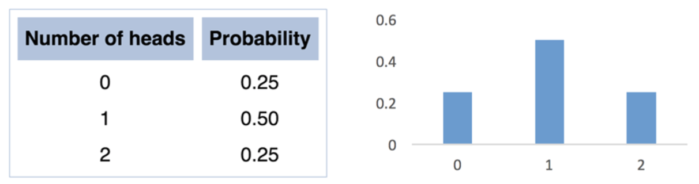
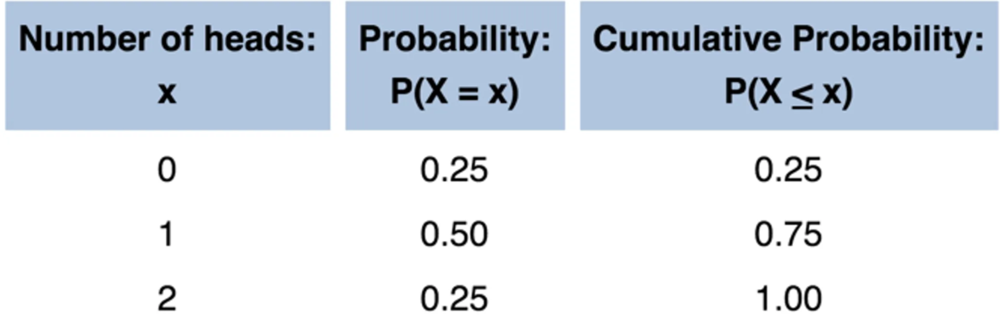
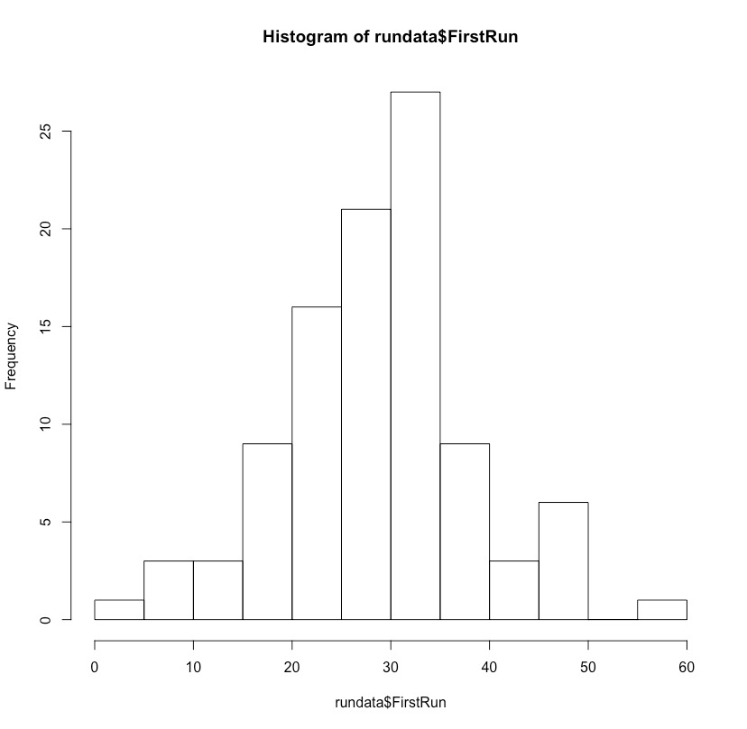
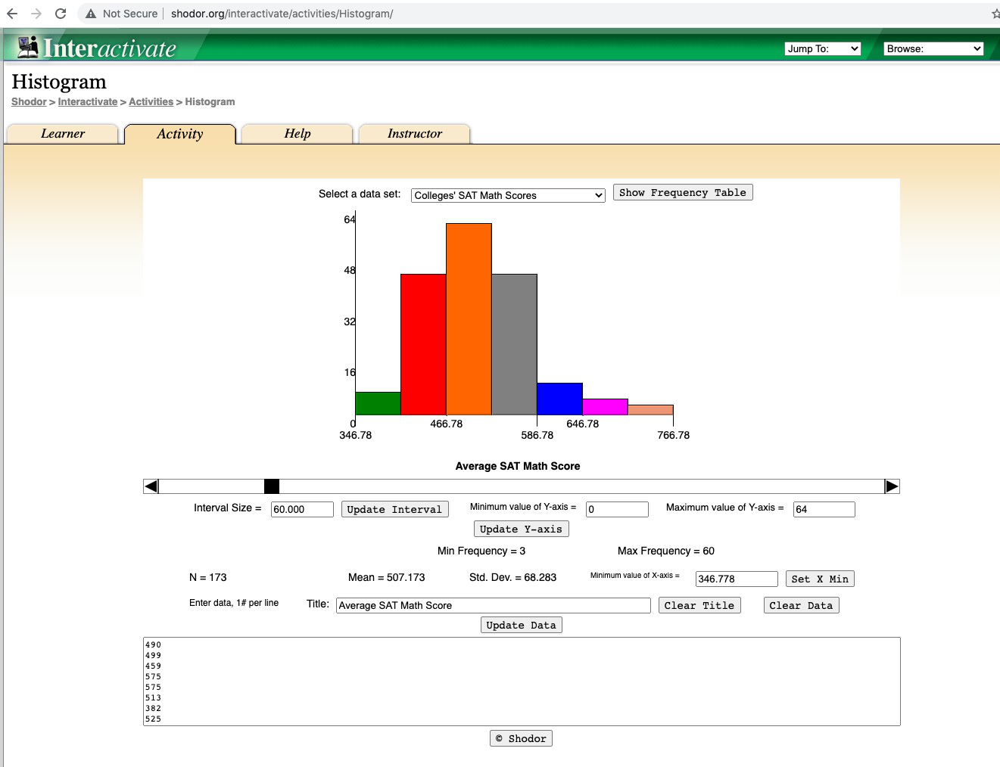
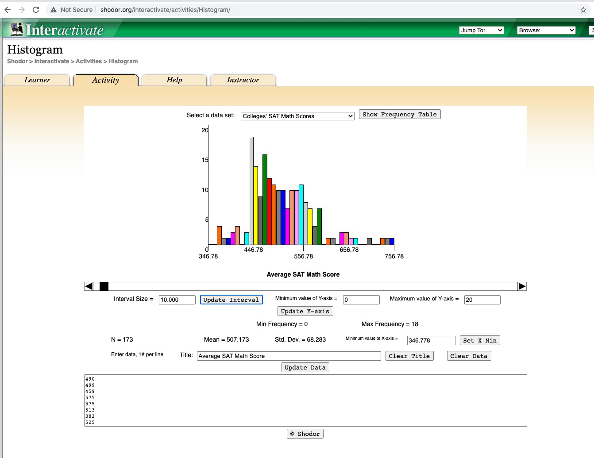
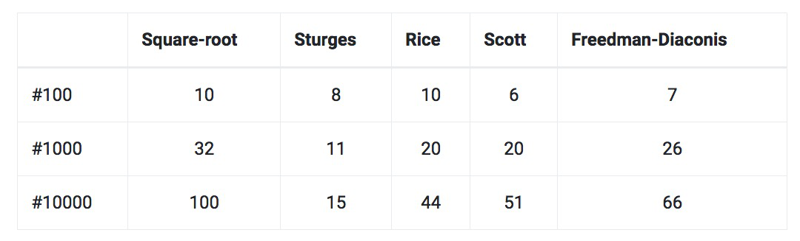
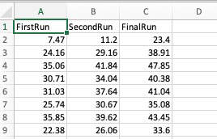

# What is exploratory data analysis? EDA

## Random variables

> *“A random variable, usually written X, is a variable* *whose possible values are numerical outcomes of a* *random phenomenon.”* [http://www.stat.yale.edu/Courses/1997-98/101/ranvar.html](http://www.stat.yale.edu/Courses/1997-98/101/ranvar.html)
> 

Two types:

- Discrete (number of students in a class)
- Continuous (amount of time it take to run a mile)

### Discrete and Continuous

$$
X = \begin{cases}
1 & \text{heads} \\
2 & \text{ tails}
\end{cases}
$$

*Y = Time it takes to run a mile*

## **Probability distribution**

> *“A probability distribution is… an equation that* *links each outcome of a statistical experiment* *with its probability of occurrence.”* [http://stattrek.com/probability-distributions/probability-distribution.aspx](http://stattrek.com/probability-distributions/probability-distribution.aspx)
> 

## Discrete Probability Distribution

Suppose you flip a coin 2 times.

Possible outcomes: **HH, HT, TH and TT**

E.G. Probability distribution of the number of heads?



[http://stattrek.com/probability-distributions/probability-distribution.aspx](http://stattrek.com/probability-distributions/probability-distribution.aspx)

## Cumulative probability

> *“A cumulative probability refers to the probability* *that the value of a random variable falls within a* *specified range.”*
[https://stattrek.com/statistics/dictionary.aspx?definition=cumulative_probability](https://stattrek.com/statistics/dictionary.aspx?definition=cumulative_probability)
> 

Probability that 2 coin flips includes 1 or fewer heads?

$$
P(X ≤ 1) = P(X = 0) + P(X = 1) = 0.25 + 0.50 = 0.75
$$



[https://www.khanacademy.org/math/statistics-probability/random-variables-stats-library/discrete-and-continuous-random-variables/v/discrete-probability-distribution](https://www.khanacademy.org/math/statistics-probability/random-variables-stats-library/discrete-and-continuous-random-variables/v/discrete-probability-distribution)

## Continuous variables

- Height, weight, distance, time etc.
- So how do we work with continuous variables and their distributions?



## Discretization / Quantization of continuous variables

- Range = max – min
- Number of intervals/bins: Not less than 10 and no more than 20

Step interval size = range / number of intervals/bins

$$
k = \left\lceil \frac{\max x - \min x}{h} \right\rceil .
$$

This formula is used to calculate the number of bins or intervals needed to divide a range of data, often used in creating histograms.

In simple terms:

- Take the maximum value in your dataset
- Subtract the minimum value in your dataset
- Divide this range by h (which represents the width of each bin)
- Round up to the nearest whole number

The result, k, tells you how many bins of width h you would need to cover the entire range of your data.

For example, if your data ranges from 10 to 45, and you want each bin to be 5 units wide, you would calculate:
k = ceiling((45 - 10)/5) = ceiling(7) = 7

So you would need 7 bins to cover the entire range of data with bins of width 5.

<aside>


*Intervals are also known as bins (k=bin width)*

</aside>

Histograms can change depending on the number of bins





[http://www.shodor.org/interactivate/activities/Histogram/](http://www.shodor.org/interactivate/activities/Histogram/)

## Computing Bin size

- **Square-root choice**
    
    $$
    k = \sqrt n ,
    $$
    
- **Sturges' formula**
    
    $$
    k = \lceil log_2~n \rceil + 1,
    $$
    
    - If n was 8 then k = 4
    - If n was 16 then k = 5
- **Freedman-Diaconis**
- **Rice**
- **Scott**
- **…**

### **Number of bins computed**



## Continuous Probability Distribution

Distribution of times it took you to drive to work **(average=50, SD=20)**

What is the probability that it will take you 50 minutes?

**P(Y = 50)**


Distribution of times it took you to drive to work (average=50, SD=20)

**P(49 < Y < 51)**


Distribution of times it took you to drive to work **(average=50, SD=20)** 

**P(49 < Y < 51)**

### **tigerstats R package**

```{r}
library("tigerstats")
?pnormGC
pnormGC( c(49,51), region="between", mean=50, sd=20, graph=TRUE )
```


## Descriptive statistics – I know you know this

- Central tendency
    - mean, median, mode, geometric mean interquartile mean…
- Spread
    - variance, standard deviation, range, interquartile range

## What measures should I use?

- Parametric statistics
    - Mean ± SD
    - t-test family
    - Pearson correlation
- Non-parametric statistics
    - Median ± IQR
    - Wilcoxon or Mann Whitney test
    - Spearman correlation


Exact distribution vs. using an approximate distribution

## Central limit theorem

> *“If the sample is large (n>=30) then statistical theory says that the sample mean is normally distributed... This is a result of a famous statistical theorem, the Central limit theorem.”* Source: [https://en.wikibooks.org/wiki/Statistics/Testing_Data/t-tests](https://en.wikibooks.org/wiki/Statistics/Testing_Data/t-tests)
> 

### Normal distribution

$$
AreaUnderNormalCurve = \int_{-\infty}^{\infty} f(x)dx = 1
$$

](lecimages/image20.png)

[https://commons.wikimedia.org/wiki/File:Empirical_Rule.PNG](https://commons.wikimedia.org/wiki/File:Empirical_Rule.PNG)

### Cumulative distribution function (CDF)

mean=50, SD=25


```{r}
#pnorm(x, mean, sd)
pnorm(30, 50, 25)
```

### Standardisation and Z-values


- A z-value is used to standardise a number so that it becomes ‘metric agnostic’
- Z-values then can be summed with z-values derived from other metrics to create a composite score.

## Problem with z-scores

- From –infinity to +infinity
- Confusing

## Sigma scale

- All positive scores
- Divide distribution into 100 equal parts
- 0 = 3 SDs below the mean
- 100 = 3 SDs above the mean

16z + 50

## Hull scale

- All positive scores
- Divide distribution into 100 equal parts
- 0 = 3.5 SDs below the mean
- 100 = 3.5 SDs above the mean

14z + 50

## t scale

- All positive scores
- Divide distribution into 100 equal parts
- 0 = 5 SDs below the mean
- 100 = 5 SDs above the mean

10 Z + 50

## Whilst you might assume that your variable is normally distributed, you should test this?

](lecimages/image25.png)

[http://stattrek.com/statistics/charts/data-patterns.aspx?Tutorial=AP](http://stattrek.com/statistics/charts/data-patterns.aspx?Tutorial=AP)

## Skewness

Example – what about salary distribution

](lecimages/image26.png)

[https://commons.wikimedia.org/wiki/File:Relationship_between_mean_and_median_under_different_skewness.png](https://commons.wikimedia.org/wiki/File:Relationship_between_mean_and_median_under_different_skewness.png)

E.g. mean is a bad measure of the distribution if the variable is skewed

## Kurtosis

Measure of the tailedness and peakness


## Kurtosis

- Kurtosis of a normal distributed variable is 3.
- Distributions with kurtosis less than 3 are said to be *platykurtic*
- Distributions with kurtosis greater than 3 are said to be *leptokurtic*.

## Types of distributions

- Normal (Gaussian)
- Binomial distributions
- Chi-square

*Tutorial on other distributions*

- Uniform
- Beta
- Gamma
- Poisson
- Exponential
- Log
- … … …

## Discretization features for Machine Learning

- Some algorithms may only use nominal features
    - E.g. Decision trees
- How would you convert heights to categories? E.g. small, typical, tall…
- Is there an optimal method for this?

## **Entropy-Based Discretization**

$$
\text{Entropy}(D_1) = -\sum_{i=1}^{m} p_i \log_2\,p_i
$$

M = number of classes

P = probability, e.g. number of people aged <25 earning <=50k (class)

|               | **Salary <60k** | **Salary >60k** |
|---------------|-----------------|-----------------|
| **Aged <30**  | 30              | 2               |
| **Aged >30**  | 8               | 22              |

```{r}
# Entropy(age<30) = (30/32 * log2(30/32)) + (2/32 * log2(2/32)) = 0.3372901
# Entropy(age>30) = (8/30 * log2(8/30)) + (22/30 * log2(22/30)) = 0.8366407
# Net entropy = mean(c(0.3372901, 0.8366407)) = 0.5869654
```

<aside>


Be careful when dichotomizing variables (converting a numeric variable into categories)

</aside>

# Exercise - Tutorial

Open rundata.csv on BBL

**Open in Excel**

## How you can generate data

```{r}
# if issues run the following:
# getwd()
# setwd("./week2")

rundata <- read.csv("../rundata.csv")
rundata$FirstRun <- rnorm(99, 30, 10)
rundata$SecondRun <- rundata$FirstRun + rnorm(99, 5, 2)
rundata$FinalRun <- rundata$SecondRun + rnorm(99, 7, 3)
```




Let’s assume each row is a runner and each number is how far they ran at each consecutive run.

### Tutorial

```{r}
rundata$FirstRun
mean(rundata$FirstRun)
sd(rundata$FirstRun)
summary(rundata$FirstRun)
```


### hist(rundata$FirstRun)
```{r}
hist(rundata$FirstRun)
```


## Other parameters

```{r}
#?hist
hist(rundata$FirstRun, ylab="y-axis title", xlab="x-axis title", main="main title")
dens <- density(rundata$FirstRun)
plot(dens)
```


```{r}
convertToFunc <- with(dens, splinefun(x,y))
integrate(convertToFunc, lower=20, upper=25)
```

### Normality Testing

Shapiro-Wilk test of normality.

```{r}
shapiro.test(rundata$FirstRun)
```

**Hypothesis test**

$$
H_0 = Null~ hypothesis:~ Data~ is~ normally~ distributed
$$

$$
H_1 = Alternative~ hypothesis:~ Data~ is~ not~
 normally~ distributed
$$


```{r}
plot(density(rundata$FirstRun), col="red")
lines(density(rundata$SecondRun), col="green")
legend("bottom", legend = c("First run","Second run"), fill=c("red","green"))
```


```{r}
boxplot(rundata)
?boxplot
```


```{r}
plot(rundata$FirstRun, rundata$SecondRun)
```


```{r}
time <- c(19.09, 19.55, 17.89, 17.73, 25.15, 27.27, 25.24, 21.05, 21.65, 20.92, 22.61, 15.71, 22.04, 22.60, 24.25)
```

```{r}
library(moments) #*slightly skewed* 
skewness(time)
```

```{r}
kurtosis(time) #platykurtic…
```

[https://www.r-bloggers.com/measures-of-skewness-and-kurtosis/](https://www.r-bloggers.com/measures-of-skewness-and-kurtosis/)

```{r}
library(ggplot2)
qplot(time, geom = 'histogram', binwidth = 2) + xlab('Time')
```


```{r}
sample <- rnorm(n = 10000, mean = 55, sd = 4.5)
library(moments)
skewness(sample)
```

```{r}
kurtosis(sample)
```

```{r}
#Histogram
library(ggplot2)
datasim <- data.frame(sample)
ggplot(datasim, aes(x = sample), binwidth = 2) +
	geom_histogram(aes(y = ..density..), fill = 'red', alpha = 0.5) +
	geom_density(colour = 'blue') + xlab(expression(bold('Simulated Samples'))) +
	ylab(expression(bold('Density')))
```


## Generating a Normal Distribution of a Random Variable

```{r}
?rnorm
x <- rnorm(10)
x <- rnorm(10, 20, 2)
summary(x)
```


<aside>


Can I transform my data to make it normally distributed?

Try taking the *log()* of your vector

</aside>

Other exercises

[https://www.r-bloggers.com/normal-distribution-functions/](https://www.r-bloggers.com/normal-distribution-functions/)

[https://www.r-bloggers.com/measures-of-skewness-and-kurtosis/](https://www.r-bloggers.com/measures-of-skewness-and-kurtosis/)

[https://www.r-statistics.com/2013/05/log-transformations-for-skewed-and-wide-distributions-from-practical-data-science-with-r/](https://www.r-statistics.com/2013/05/log-transformations-for-skewed-and-wide-distributions-from-practical-data-science-with-r/)