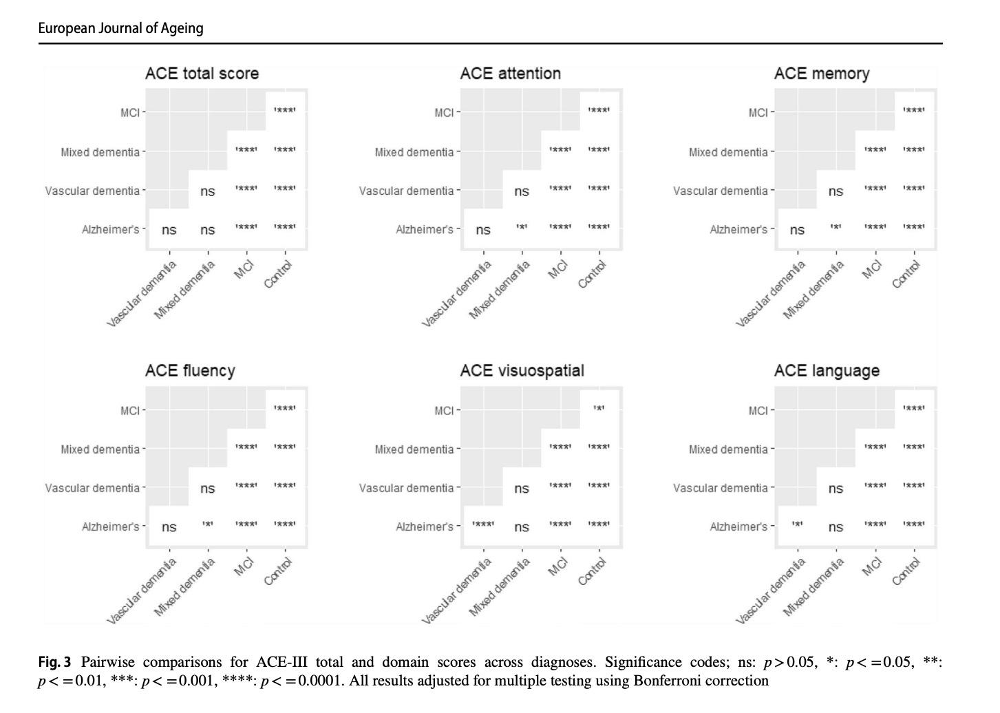
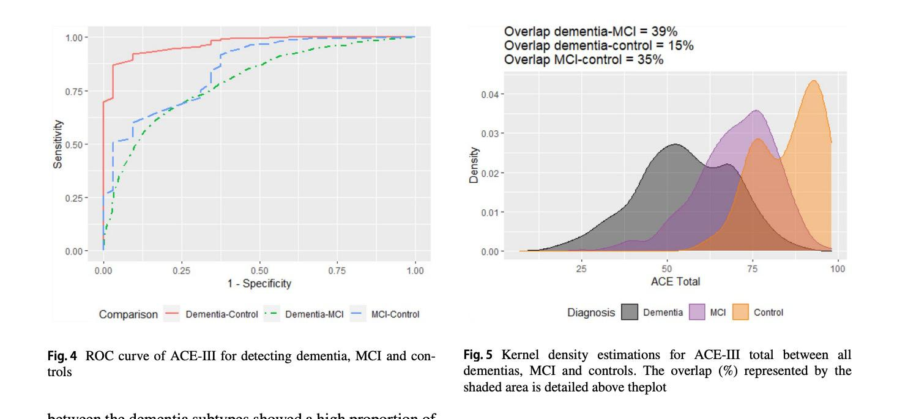
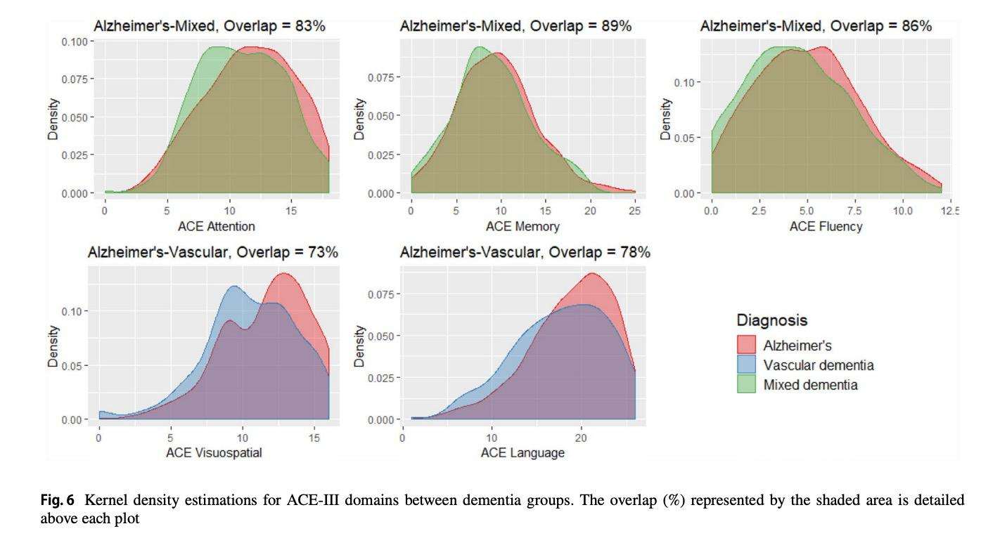
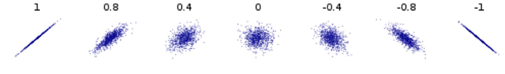
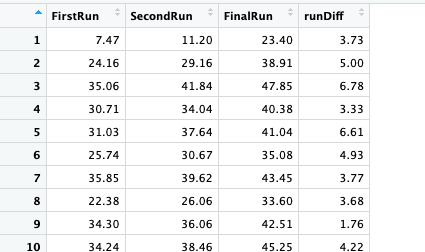

# Week 3 - Exercise 2

Experiment – simulation exercise

Use the code in the following slide to study the relationship between different
sample sizes, different effect sizes and the probability of achieving a true
positive/detecting a difference (p\<0.05)

Simply manipulate the variables to study the different outcomes.

```{r}
samplesize <- 200 # Sample size of each group
meanX <- 50
meanY <- 51
sdX <- 5 # Population Parameters
sdY <- 5
pvalues <- vector(length=100)
effectSize <- abs(meanX - meanY) / sqrt( ((sdX*sdX)+(sdY*sdY)) / 2 )
effectSize

for(i in 1:100){ # 100 Different Studies are performed
	x <- rnorm(samplesize, meanX, sdX) # Each study takes a sample from each pop group
	y <- rnorm(samplesize, meanY, sdY)
	
	p <- t.test(x,y, PAIRED=FALSE) # Each study performs a test
	
	pvalues[i] <- p$p.value
}

hist(pvalues, breaks=20)
length(pvalues[pvalues<0.05]) # How many studies achieved stat significance/ true positive
```

# R power functions

-   Explore the built in R power test functions
-   What sample size do you need for a 80% chance (aka power) of detecting an
    effect size of 0.5 between two different groups:

```{r}
power.t.test(power = .80, delta = 0.5, type="two.sample")
```

Now try other scenarios.

-   Explore the pwr package:
    -   <https://www.statmethods.net/stats/power.html>
    -   e.g. pwr.t.test(n=100 , d = 0.5 , sig.level = 0.05 , type =
        c("two.sample"))

# Case study - read the following paper

-   Cognitive scores (ACE scores) to assess for dementia
    -   <https://pure.ulster.ac.uk/ws/portalfiles/portal/92526119/Potts2021_Article_ReliabilityOfAddenbrookeSCogni.pdf>

> Potts, C., Richardson, J., Bond, R.B., Price, R.K., Mulvenna, M.D., Zvolsky,
> P., Harvey, M., Hughes, C.F. and Duffy, F., 2022. Reliability of Addenbrooke's
> Cognitive Examination III in differentiating
>
> between dementia, mild cognitive impairment and older adults who have not
> reported cognitive problems. *European Journal of Ageing*, *19*(3),
> pp.495-507.







# Tutorial

Using rundata.csv

Create a scatter plot

Plot a regression line to show the trend

```{r}
plot(rundata$FirstRun, rundata$SecondRun)
reg1 <- lm( rundata$SecondRun ~ rundata$FirstRun)
abline(reg1)
title("Scatter plot with regression line")
```

# Explore the different Graphs in R

-   [http://www.statmethods.net/graphs/creating.](http://www.statmethods.net/graphs/creating.html)
    [html](http://www.statmethods.net/graphs/creating.html)
    -   Dot Plots
    -   [Bar Plots](http://www.statmethods.net/graphs/bar.html)
    -   [Line Charts](http://www.statmethods.net/graphs/line.html)
    -   [Pie Charts](http://www.statmethods.net/graphs/pie.html)
    -   [Boxplots](http://www.statmethods.net/graphs/boxplot.html)
    -   [Scatter Plots](http://www.statmethods.net/graphs/scatterplot.html)

# Compute the Pearson Correlation Coefficient

```{r}
cor(rundata$FirstRun, rundata$SecondRun)
```

*r* = 0.9762012



<https://en.wikipedia.org/wiki/Correlation>

# Check if the Correlation is significant

```{r}
cor.test(rundata$FirstRun, rundata$SecondRun)
```

# Task – try to answer the following question using the cor() function

-   Which runs correlate the most?

# Add a new column to the Data Frame to compute the differences in the distances ran between the first two runs

```{r}
rundata$runDiff <- rundata$SecondRun - rundata$FirstRun
```



# Task - Data Frame Subsetting

-   How many people ran more than 30km in their first run?

```{r}
y <- rundata$FirstRun[rundata$FirstRun > 30] 
length(y)

length( rundata$FirstRun[rundata$FirstRun > 30])
```

-   Find out how many people did better in their second run?

```{r}
x <- rundata$runDiff[rundata$runDiff >= 1] 
length(x)

x <- rundata$runDiff[rundata$runDiff < 0] 
length(x)
```

# Hypothesis testing

Is there a statistical difference between how far people ran in the first and
second run?

```{r}
t.test(rundata$FirstRun, rundata$SecondRun, paired=TRUE)
```
