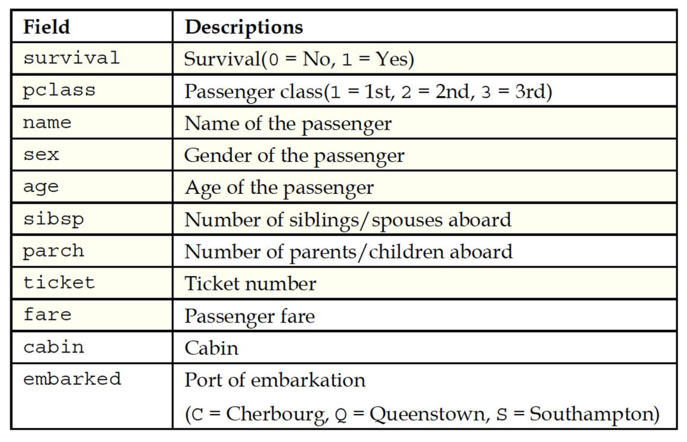

# Week 4 - Exercise

# Iris

Download the Iris dataset and import it into R:

<https://www.kaggle.com/datasets/uciml/iris?resource=download>

Calculate correlations between variables:

```{r}
cor.test(iris$Sepal.Length, iris$Sepal.Width, method="pearson")
```

Now also create a scatter plot:

```{r}
plot(iris$Sepal.Length, iris$Sepal.Width)
```

Create an adjacency matrix and interpret the results:

```{r}
cor(iris[c("Sepal.Length","Sepal.Width", "Petal.Length","Petal.Width")])
```

What do they mean?

**Now create SPLOM graphics:**

```{r}
pairs(iris[c("Sepal.Length","Sepal.Width", "Petal.Length","Petal.Width")])
install.packages("psych")
library(psych)
pairs.panels(iris[c("Sepal.Length","Sepal.Width", "Petal.Length","Petal.Width")])
```

**Have a go at writing a paragraph to summarize the findings in this plot?**

# Rundata

Open in rundata.csv in R

Plot data and create regression line

```{r}
plot(rundata$FirstRun, rundata$SecondRun)
```

```{r}
plot(rundata$FirstRun, rundata$SecondRun)
reg1 <- lm( rundata$SecondRun~rundata$FirstRun)
abline(reg1)
```

Compute the Pearson Correlation Coefficient

```{r}
cor(rundata$FirstRun, rundata$SecondRun)
```

*r* = 0.9762012

Check if the Correlation is significant

```{r}
cor.test(rundata$FirstRun, rundata$SecondRun)
```

Create a Multiple Regression Model to predict the distance achieved in the final
run based on the previous runs

```{r}
lma <- lm(rundata$FinalRun ~ FirstRun + SecondRun, data=rundata)
summary(lma)
# help("~") - tilde is used to separate the left- and right-hand sides in a model formula.
```

Now interpret the results

Predict the final run distance based on a new runner who has only ran the first
2 runs

```{r}
lma <- lm(FinalRun ~ FirstRun + SecondRun, data=rundata)
newdata <- data.frame(FirstRun=22, SecondRun=25)
predict(lma, newdata)
# help("~") - tilde is used to separate the left- and right-hand sides in a model formula.
```

## Simple Regression Tutorial

```{r}
set.seed(12345)
run2 <- rundata[ order( runif(99) ) , ]
lma <- lm(FinalRun ~ FirstRun + SecondRun, data=run2[c(1:80),])
testing <- run2[c(81:99), ] 
predictions <- predict(lma, testing)

diff <- predictions - testing$FinalRun 
diff_ABS <- abs(diff) 

mean(diff)
hist(diff_ABS)
boxplot(diff_ABS)

```

How many predicted distances of the final run were higher than the real distance
of the final run

```{r}
length( diff[diff> 0] )
```

How many predicted distances were within 2km of the real distance of the final
run?

```{r}
length( diff_ABS[diff_ABS<=2] )

testing$prediction <- predictions
testing$difference <- diff_ABS
```


You should have two new columns similar to this.

Now build a logistic regression model

```{r}
rundata$superrun = ifelse(rundata$FinalRun >= 45, 1, 0)
logitModel <- glm(superrun ~ FirstRun + SecondRun, 
									data=rundata, family=binomial(link="logit"))
									
summary(logitModel)
```

Compute the Odds Ratios and Confidence Intervals

```{r}
exp(coef(logitModel))
exp(cbind(OR = coef(logitModel),
confint(logitModel)))
```


# Titanic

**Now build a logistic regression binary classifier model to predict if a
passenger survived on the titanic**

Studying the Titanic passenger survival

-   Titanic dataset from Kaggle <https://www.kaggle.com/c/titanic>
-   build a logistic regression model for survival



```{r}
#survival train target
train_target<-train$Survived
train_df<-train[c("Pclass","Age", "Survived")]
#trained model using training dataset of inputs and labels defined above
#now going to take testing data to do predictions
#compare accuracy - model performance 
#building a logistic regression model 
logitModel <- glm(Survived ~ Age + Pclass,
                  data=train, family=binomial(link="logit"))
summary(logitModel)
#Null deviance: 964.52  on 713  degrees of freedom
#Residual deviance: 827.43  on 711  degrees of freedom
#(177 observations deleted due to missingness)
#AIC: 833.43
#Number of Fisher Scoring iterations: 4
logitModel
?glm
#parameter to do prediction
predict(logitModel,test,type="response")
#removing N/a's
#test<-test[is.na(test$Pclass)&is.na(test$Age)]
test_clean<-subset(test, !is.na(test$Age))
#code above removed the N/A values from age 
test_clean<-subset(test_clean, !is.na(test_clean$Pclass))
predict(logitModel,test_clean,type="response")
#has removed the N/a values from age but has them properly indexed 
test_predict<- predict(logitModel,test_clean,type="response")
#giving predict on cleaned data
round(test_predict,digits=0)
#rounding to 0 dp / round number 
```

# Reading

**Read and explore Chapter 6: *“Forecasting Numeric Data – Regression Methods”*
in the following book:**

You may explore this chapter in the class but this can be completed outside of
the lab. The chapter walks you through a number of practical regression related
examples with data and code etc.

-   Lantz, B. (2023) Machine Learning with R, Packt Publishing.
    <https://learning.oreilly.com/library/view/machine-learning-with/9781801071321/>

# Time series analysis with R

Number of births per month in NY (1946 – 1959)

### Use the ts() function to plot some time series data

```{r}
births <- scan("http://robjhyndman.com/tsdldata/data/nybirths.dat")
birthstimeseries <- ts(births, frequency=12, start=c(1946,1))
plot.ts(birthstimeseries)

```

Note: If the scan function wont import the data then download the dataset
(<http://robjhyndman.com/tsdldata/data/nybirths.dat>) and import it into R
studio.

<https://a-little-book-of-r-for-time-series.readthedocs.io/en/latest/src/timeseries.html>

### Now add a regression line to study the trend:

```{r}
plot.ts(birthstimeseries)
abline(reg=lm(birthstimeseries~time(birthstimeseries)))
```

### Try using a simple moving average to also study the trend. You might need to install the TTR library.

```{r}
library("TTR")
birthstimeseries <- SMA(birthstimeseries, n=15)
plot.ts(birthstimeseries)
```

After SMA is applied

### Now Study the Seasonality Trend Decomposition (STD):

```{r}
birthstimeseriescomponents <- decompose(birthstimeseries)
plot(birthstimeseriescomponents)
```

### Try filtering out the random signal:

```{r}
birthstimeseriescomponents <- decompose(birthstimeseries)
birthstimeseriesseasonallyadjusted <- birthstimeseries 
- birthstimeseriescomponents$random
plot.ts(birthstimeseriesseasonallyadjusted)
```

### Study auto-correlation where the lag=1

```{r}
plot(birthstimeseries[2:168], birthstimeseries[1:167]) 
cor(birthstimeseries[2:168], birthstimeseries[1:167])
```

r=0.7880606

### Now compute the auto-correlation for 1-24 lags

```{r}
acf( birthstimeseries, lag.max=24 )
```

Notice that the correlation is highest when there is a 12 month lag

### Now compute the partial auto-correlation

```{r}
pacf(birthstimeseries, lag.max=24)
```

### Use the Augmented dickey fuller test for stationarity

-   Null hypothesis: non-stationary
-   Alternative hypothesis: stationary

```{r}
library("tseries")
adf.test(birthstimeseries)
```

Is the time series stationary?

### **Now try differencing the signal – notice the de-trending**

```{r}
plot.ts( diff(birthstimeseries) )
```

First order differencing

# Try ARIMA modelling using R

```{r}
library(forecast)
modelfit <- auto.arima(AirPassengers)
forecasts <- forecast( modelfit, h=50 )

plot( forecasts )
```

<https://otexts.com/fpp2/arima-r.html>

### Evaluate the accuracy of the model

```{r}
accuracy(forecasts)
```

### Have a go at trying to do training and testing

```{r}
library(forecast)
#9 years of training data
AirPassengersTrain <- ts(AirPassengers[1:108], frequency=12, start=c(1949,1))
#3 years of testing data
AirPassengersTest <- ts(AirPassengers[109:144], frequency=12, start=c(1958,1))
modelfit <- auto.arima(AirPassengersTrain)
forecasts <- forecast( modelfit, h=36 )
accuracy(f = forecasts, x = AirPassengersTest)
plot( AirPassengersTest, col="red", ylab="values")
lines(forecasts$mean, col="blue")
```

# Other links to explore /references

-   <https://www.analyticsvidhya.com/blog/2015/12/complete-tutorial-time-series-modeling/>
-   <https://otexts.com/fpp2/>
