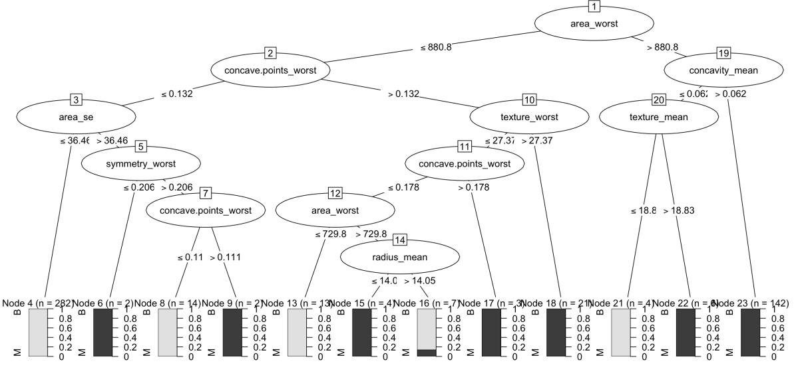

# Week 5 - Exercise 1

# **Introduction to Supervised Machine Learning & Feature Engineering (boruta)**

# Iris Dataset

Download and import the classical Iris dataset in R Studio:

<https://www.kaggle.com/datasets/uciml/iris>

We are going to explore lazy learners / K-NN classification which is an
efficient machine learning technique.

Install the following packages:

```{r}
install.packages("gmodels")
install.packages("class")
```

Use the following code. This sets the seed to ensure reproducibility.

```{r}
set.seed(1)
```

We are creating a new data frame called IrisData which is based on the imported
data frame called Iris. The following code also randomly shuffles the rows in
the dataset which is important to gain representation. We are also removing
column 1 as this is an ID column which we do not need. We are retaining columns
2 to 6.

```{r}
IrisData <- Iris[ sample(nrow(Iris), replace = FALSE), c(2,3,4,5,6)]
```

This code converts the label to a categorical variable for classification:

```{r}
IrisData$Species <- factor(IrisData$Species)
```

The following code will tell you the class distribution in the data:

```{r}
table(IrisData$Species)
prop.table(table(IrisData$Species))
```

Fortunately, this dataset is class balanced (remember class imbalance can cause
problems):

The following code standardises the numeric columns (features/variables) using
the scale function. This ensures that all features are on a similar distribution
using standard units. You could also use normalisation.

```{r}
IrisData$SepalLengthCm <- scale(IrisData$SepalLengthCm)
IrisData$SepalWidthCm <- scale(IrisData$SepalWidthCm)
IrisData$PetalLengthCm <- scale(IrisData$PetalLengthCm)
IrisData$PetalWidthCm <- scale(IrisData$PetalWidthCm)
```

To verify this, the mean and SD of a standardised variable should be 0 (mean)
and 1 (SD) respectively.

```{r}
round(mean(IrisData$SepalLengthCm))
round(sd(IrisData$SepalLengthCm))
```

This code creates training and test datasets.

```{r}
trainingData <- IrisData[c(1:100),c(1,2,3,4)]
testData <- IrisData[c(101:150),c(1,2,3,4)]
```

Notice that we leave out the labels for K-NN. However, we store the labels
separately using the following code:

```{r}
trainingLabels <- IrisData[c(1:100),c(5)]
testingLabels <- IrisData[c(101:150),c(5)]
```

This train/test split is 2/3 (two thirds, 66.66%) for training and 1/3 (one
third, 33.33%) for testing.

The following code builds our K-NN model where k=3:

```{r}
library(class)
knnModelAndPredictedLabels <- knn(train = trainingData, test = testData, cl = trainingLabels, k=3)
```

Have a look at the documentation for this function:

```{r}
?knn
```

Now present the results using cross tabulation:

Basic table:

```{r}
table(testingLabels, knnModelAndPredictedLabels)
```

Or an alternative:

```{r}
library(gmodels)
CrossTable(x = testingLabels, y = knnModelAndPredictedLabels, prop.chisq=FALSE)
```

Additional Tasks:

-   Calculate the accuracy (i.e. correct classifications / total test cases)
-   Try a 90%/10% training and test split – this allows more training examples
    to be used to build the model.
-   Re-run the model using different values of *k*
-   Can you plot the accuracy for different values of k?
-   How can you ensure that the test set is balanced?
-   Instead of using standardisation – could you use min-max normalisation?
    -   The min-max normalisation is when you subtract the minimum number from a
        given value and then divide by the range.

### 1. Calculate the accuracy

To calculate accuracy (correct classifications / total test cases):

```{r}
# Create a confusion matrix
confusion_matrix <- table(testingLabels, knnModelAndPredictedLabels)

# Calculate accuracy
accuracy <- sum(diag(confusion_matrix)) / sum(confusion_matrix)
print(paste("Accuracy:", round(accuracy, 4)))

```

### 2. Try a 90%/10% training and test split

```{r}
# Create 90%/10% split
set.seed(1)
IrisData <- Iris[sample(nrow(Iris), replace = FALSE), c(2,3,4,5,6)]
IrisData$Species <- factor(IrisData$Species)

# Standardize numeric columns
IrisData$SepalLengthCm <- scale(IrisData$SepalLengthCm)
IrisData$SepalWidthCm <- scale(IrisData$SepalWidthCm)
IrisData$PetalLengthCm <- scale(IrisData$PetalLengthCm)
IrisData$PetalWidthCm <- scale(IrisData$PetalWidthCm)

# Create 90/10 split
train_size <- round(0.9 * nrow(IrisData))
test_size <- nrow(IrisData) - train_size

trainingData <- IrisData[1:train_size, c(1,2,3,4)]
testData <- IrisData[(train_size+1):nrow(IrisData), c(1,2,3,4)]

trainingLabels <- IrisData[1:train_size, 5]
testingLabels <- IrisData[(train_size+1):nrow(IrisData), 5]

# Run KNN with k=3
knnModelAndPredictedLabels <- knn(train = trainingData, test = testData, cl = trainingLabels, k=3)

# Calculate accuracy
confusion_matrix <- table(testingLabels, knnModelAndPredictedLabels)
accuracy_90_10 <- sum(diag(confusion_matrix)) / sum(confusion_matrix)
print(paste("Accuracy with 90/10 split:", round(accuracy_90_10, 4)))

```

### 3. Re-run the model using different values of k

```{r}
# Function to run KNN with different k values
test_k_values <- function(k_values) {
  accuracies <- numeric(length(k_values))

  for (i in 1:length(k_values)) {
    k <- k_values[i]
    knn_pred <- knn(train = trainingData, test = testData, cl = trainingLabels, k = k)
    cm <- table(testingLabels, knn_pred)
    accuracies[i] <- sum(diag(cm)) / sum(cm)
  }

  return(data.frame(k = k_values, accuracy = accuracies))
}

# Test with k values from 1 to 15
k_values <- 1:15
k_results <- test_k_values(k_values)
print(k_results)

```

### 4. Plot the accuracy for different values of k

```{r}
# Plot accuracy vs k values
library(ggplot2)
ggplot(k_results, aes(x = k, y = accuracy)) +
  geom_line() +
  geom_point() +
  labs(title = "KNN Accuracy for Different k Values",
       x = "k (Number of Neighbors)",
       y = "Accuracy") +
  theme_minimal() +
  scale_x_continuous(breaks = k_values)

```

### 5. Ensure that the test set is balanced

To ensure the test set is balanced (has equal representation of all classes):

```{r}
# Stratified sampling to ensure balanced classes
set.seed(1)
IrisData <- Iris[, c(2,3,4,5,6)]
IrisData$Species <- factor(IrisData$Species)

# Standardize features
IrisData$SepalLengthCm <- scale(IrisData$SepalLengthCm)
IrisData$SepalWidthCm <- scale(IrisData$SepalWidthCm)
IrisData$PetalLengthCm <- scale(IrisData$PetalLengthCm)
IrisData$PetalWidthCm <- scale(IrisData$PetalWidthCm)

# Stratified sampling function
stratified_split <- function(data, ratio = 0.7, class_col = "Species") {
  classes <- unique(data[[class_col]])
  train_indices <- c()

  for (cls in classes) {
    cls_indices <- which(data[[class_col]] == cls)
    n_train <- round(length(cls_indices) * ratio)
    train_indices <- c(train_indices, sample(cls_indices, n_train))
  }

  list(train = sort(train_indices),
       test = setdiff(1:nrow(data), train_indices))
}

# Create stratified split
split_indices <- stratified_split(IrisData, ratio = 0.7)

trainingData <- IrisData[split_indices$train, c(1,2,3,4)]
testData <- IrisData[split_indices$test, c(1,2,3,4)]

trainingLabels <- IrisData[split_indices$train, 5]
testingLabels <- IrisData[split_indices$test, 5]

# Check class distribution in test set
print("Test set class distribution:")
print(table(testingLabels))
print(prop.table(table(testingLabels)))

# Run KNN with k=3 on balanced sets
knnModelAndPredictedLabels <- knn(train = trainingData, test = testData, cl = trainingLabels, k=3)

# Calculate accuracy
confusion_matrix <- table(testingLabels, knnModelAndPredictedLabels)
balanced_accuracy <- sum(diag(confusion_matrix)) / sum(confusion_matrix)
print(paste("Accuracy with balanced sets:", round(balanced_accuracy, 4)))

```

### 6. Use min-max normalization instead of standardization

```{r}
# Function for min-max normalization
min_max_normalize <- function(x) {
  (x - min(x)) / (max(x) - min(x))
}

# Create new dataset with min-max normalization
set.seed(1)
IrisData <- Iris[sample(nrow(Iris), replace = FALSE), c(2,3,4,5,6)]
IrisData$Species <- factor(IrisData$Species)

# Apply min-max normalization
IrisData$SepalLengthCm <- min_max_normalize(IrisData$SepalLengthCm)
IrisData$SepalWidthCm <- min_max_normalize(IrisData$SepalWidthCm)
IrisData$PetalLengthCm <- min_max_normalize(IrisData$PetalLengthCm)
IrisData$PetalWidthCm <- min_max_normalize(IrisData$PetalWidthCm)

# Verify the normalization (should be between 0 and 1)
summary(IrisData[,1:4])

# Create training and test datasets
trainingData <- IrisData[c(1:100),c(1,2,3,4)]
testData <- IrisData[c(101:150),c(1,2,3,4)]

trainingLabels <- IrisData[c(1:100),c(5)]
testingLabels <- IrisData[c(101:150),c(5)]

# Run KNN with k=3
knnModelAndPredictedLabels <- knn(train = trainingData, test = testData, cl = trainingLabels, k=3)

# Calculate accuracy with min-max normalization
confusion_matrix <- table(testingLabels, knnModelAndPredictedLabels)
minmax_accuracy <- sum(diag(confusion_matrix)) / sum(confusion_matrix)
print(paste("Accuracy with min-max normalization:", round(minmax_accuracy, 4)))

```

### 7. Compare standardization vs. min-max normalization

To properly compare the two normalization methods, let's run a comprehensive
comparison:

```{r}
# Function to evaluate KNN with different normalization techniques and k values
compare_normalization <- function(k_values) {
  # Create datasets
  set.seed(1)
  IrisData <- Iris[sample(nrow(Iris), replace = FALSE), c(2,3,4,5,6)]
  IrisData$Species <- factor(IrisData$Species)

  # Create standardized dataset
  IrisData_std <- IrisData
  IrisData_std$SepalLengthCm <- scale(IrisData_std$SepalLengthCm)
  IrisData_std$SepalWidthCm <- scale(IrisData_std$SepalWidthCm)
  IrisData_std$PetalLengthCm <- scale(IrisData_std$PetalLengthCm)
  IrisData_std$PetalWidthCm <- scale(IrisData_std$PetalWidthCm)

  # Create min-max normalized dataset
  IrisData_mm <- IrisData
  IrisData_mm$SepalLengthCm <- min_max_normalize(IrisData_mm$SepalLengthCm)
  IrisData_mm$SepalWidthCm <- min_max_normalize(IrisData_mm$SepalWidthCm)
  IrisData_mm$PetalLengthCm <- min_max_normalize(IrisData_mm$PetalLengthCm)
  IrisData_mm$PetalWidthCm <- min_max_normalize(IrisData_mm$PetalWidthCm)

  # Create training and test splits (using the same indices for both)
  train_idx <- 1:100
  test_idx <- 101:150

  train_std <- IrisData_std[train_idx, 1:4]
  test_std <- IrisData_std[test_idx, 1:4]
  train_mm <- IrisData_mm[train_idx, 1:4]
  test_mm <- IrisData_mm[test_idx, 1:4]

  train_labels <- IrisData[train_idx, 5]
  test_labels <- IrisData[test_idx, 5]

  # Results dataframe
  results <- data.frame(
    k = integer(),
    std_accuracy = numeric(),
    minmax_accuracy = numeric()
  )

  # Test different k values
  for (k in k_values) {
    # Standardized
    knn_std <- knn(train = train_std, test = test_std, cl = train_labels, k = k)
    cm_std <- table(test_labels, knn_std)
    acc_std <- sum(diag(cm_std)) / sum(cm_std)

    # Min-max
    knn_mm <- knn(train = train_mm, test = test_mm, cl = train_labels, k = k)
    cm_mm <- table(test_labels, knn_mm)
    acc_mm <- sum(diag(cm_mm)) / sum(cm_mm)

    results <- rbind(results, data.frame(k = k, std_accuracy = acc_std, minmax_accuracy = acc_mm))
  }

  return(results)
}

# Run comparison for k values 1 to 15
comparison_results <- compare_normalization(1:15)
print(comparison_results)

# Plot comparison
library(tidyr)
library(ggplot2)

comparison_long <- pivot_longer(comparison_results,
                               cols = c(std_accuracy, minmax_accuracy),
                               names_to = "method",
                               values_to = "accuracy")

ggplot(comparison_long, aes(x = k, y = accuracy, color = method)) +
  geom_line() +
  geom_point() +
  labs(title = "KNN Accuracy: Standardization vs Min-Max Normalization",
       x = "k (Number of Neighbors)",
       y = "Accuracy",
       color = "Method") +
  theme_minimal() +
  scale_color_manual(values = c("std_accuracy" = "blue", "minmax_accuracy" = "red"),
                     labels = c("std_accuracy" = "Standardization", "minmax_accuracy" = "Min-Max")) +
  scale_x_continuous(breaks = 1:15)

```

# **Breast Cancer Wisconsin (Diagnostic) dataset**

Now let’s try a different dataset:

Open up the machine learning with R book at chapter 3 “Lazy Learning”.

Follow through the chapter/tutorial on using K-NN with the “Breast Cancer
Wisconsin (Diagnostic)” dataset. The dataset provides a series of features and a
target class/label called ‘Diagnosis’ which you can use K-NN to predict.

Download the cancer dataset as a CSV file:

<https://www.kaggle.com/datasets/uciml/breast-cancer-wisconsin-data>

In the chapter, you will see how you can use K-NN to predict whether the cancer
is ‘benign’ or ‘malignant’.

**Decision trees**

Install the following package:

```{r}
install.packages("C50")
```

Import the **Breast Cancer Wisconsin (Diagnostic) dataset** and name it ‘data’.

Like before – lets shuffle the rows in the dataset to ensure representation. We
also only select columns 2 to 32.

```{r}
set.seed(1)
DataDF <- data[ sample(nrow(data), replace = FALSE),c(2:32)]
```

We also need to cast the label as a factor/categorical variable for
classification:

```{r}
DataDF$diagnosis <- factor(DataDF$diagnosis)
```

The dataset labels are imbalanced but let’s leave this as it is.

```{r}
table(DataDF$diagnosis)
```

Let’s create our training and test sets:

```{r}
trainingDataDT <- DataDF[c(1:500),]
testDataDT <- DataDF[c(501:569),]
```

This train/test split here is almost a 90%/10% split (approx. 88%/12% split)

Let’s build the decision tree:

```{r}
library(C50)
decisionTree <- C5.0(diagnosis ~., data=trainingDataDT)
summary(decisionTree)
```

Here you can see the logic/decision rules and the important features.

**The % is the % of training cases/rows that used that feature to make the
prediction when using the decision tree.**

Have a look at the documentation to understand other arguments:

```{r}
?C5.0
```

You can also plot the tree:

```{r}
plot(decisionTree)
```



Test the model on the test set:

```{r}
decisionTreePredictions <- predict(decisionTree, testDataDT) 
```

You can now display the results using the code:

```{r}
table(decisionTreePredictions, testDataDT$diagnosis) 
```

or:

```{r}
CrossTable(x = decisionTreePredictions, y = testDataDT$diagnosis, prop.chisq=FALSE)
```

Calculate the accuracy, sensitivity and specificity.

From confusion matrix: - True Negatives (TN) = 40 (Predicted B, Actual B) -
False Negatives (FN) = 2 (Predicted B, Actual M) - False Positives (FP) = 1
(Predicted M, Actual B) - True Positives (TP) = 26 (Predicted M, Actual M)

Let's calculate the metrics:

```{r}
# # Accuracy = (TP + TN) / (TP + TN + FP + FN)
# # accuracy = (26 + 40) / (26 + 40 + 1 + 2)
# # accuracy = 66 / 69 = 0.9565 (95.65%)
# 
# # Sensitivity (True Positive Rate) = TP / (TP + FN)
# # This measures the proportion of actual positives correctly identified
# # In this case, sensitivity is for class M (assuming M is the positive class)
# sensitivity = 26 / (26 + 2)
# sensitivity = 26 / 28 = 0.9286 (92.86%)
# 
# # Specificity (True Negative Rate) = TN / (TN + FP)
# # This measures the proportion of actual negatives correctly identified
# specificity = 40 / (40 + 1)
# specificity = 40 / 41 = 0.9756 (97.56%)
```

Therefore: - Accuracy: 95.65% - Sensitivity: 92.86% - Specificity: 97.56%

These results indicate that your decision tree model is performing quite well,
with high accuracy overall and good balance between sensitivity and specificity,
meaning it's effective at identifying both positive (M) and negative (B) cases.

Now try improving the model using boosting via the trials argument.

```{r}
decisionTree <- C5.0(diagnosis ~., data=trainingDataDT, trials = 10)
```

**Additional tasks:**

-   Create different training and test splits, 80:20, 70:30 and 60:40 – and see
    how this effects the results.
    -   E.g. 569 \* 0.7 = 398 cases for the training set for a 70%/30% split
-   Rebalance the classes – a basic approach is to consider using the sample
    function for oversample the minority class or use another library.
-   Does selecting features/removing features improve the model?
-   Try statistical tests (e.g. t-tests) to use p-values for feature selection,
    i.e. if a numeric feature is statistically significant in separating the two
    diagnostic groups then this could be kept as a feature etc.
-   Use the Boruta approach to select features

### First, let's set up the basic workflow:

```{r}
# Install required packages
install.packages("C50")
install.packages("gmodels")
install.packages("caret")
install.packages("Boruta")

# Load libraries
library(C50)
library(gmodels)
library(caret)
library(Boruta)

# Load and prepare the data
set.seed(1)
DataDF <- data[sample(nrow(data), replace = FALSE), c(2:32)]
DataDF$diagnosis <- factor(DataDF$diagnosis)

# Check class distribution
table(DataDF$diagnosis)
prop.table(table(DataDF$diagnosis))

```

### 1. Create different training and test splits (80:20, 70:30, 60:40)

```{r}
# Function to evaluate model with different splits
evaluate_splits <- function(data, split_ratios) {
  results <- data.frame(
    split_ratio = character(),
    accuracy = numeric(),
    sensitivity = numeric(),
    specificity = numeric(),
    stringsAsFactors = FALSE
  )

  for (ratio in split_ratios) {
    # Calculate training size
    train_size <- floor(nrow(data) * ratio)

    # Create training and test sets
    train_data <- data[1:train_size, ]
    test_data <- data[(train_size + 1):nrow(data), ]

    # Build and test model
    dt_model <- C5.0(diagnosis ~ ., data = train_data)
    predictions <- predict(dt_model, test_data)

    # Create confusion matrix
    cm <- confusionMatrix(predictions, test_data$diagnosis, positive = "M")

    # Store results
    results <- rbind(results, data.frame(
      split_ratio = paste0(ratio*100, ":", (1-ratio)*100),
      accuracy = cm$overall["Accuracy"],
      sensitivity = cm$byClass["Sensitivity"],
      specificity = cm$byClass["Specificity"]
    ))
  }

  return(results)
}

# Test different split ratios
split_ratios <- c(0.8, 0.7, 0.6)
split_results <- evaluate_splits(DataDF, split_ratios)
print(split_results)

# Plot results
library(ggplot2)
library(tidyr)

split_results_long <- pivot_longer(split_results,
                                  cols = c(accuracy, sensitivity, specificity),
                                  names_to = "metric",
                                  values_to = "value")

ggplot(split_results_long, aes(x = split_ratio, y = value, fill = metric)) +
  geom_bar(stat = "identity", position = "dodge") +
  labs(title = "Model Performance with Different Training/Test Splits",
       x = "Train:Test Split Ratio",
       y = "Value") +
  theme_minimal() +
  scale_fill_brewer(palette = "Set1")

```

### 2. Rebalance the classes

```{r}
# Function to balance classes through oversampling
balance_classes <- function(data) {
  # Identify classes
  classes <- unique(data$diagnosis)
  counts <- table(data$diagnosis)
  max_count <- max(counts)

  # Create balanced dataset
  balanced_data <- data[0, ]

  for (cls in classes) {
    # Get all samples of this class
    cls_data <- data[data$diagnosis == cls, ]

    # If this is the minority class, oversample
    if (nrow(cls_data) < max_count) {
      # Oversample with replacement
      oversampled <- cls_data[sample(1:nrow(cls_data), max_count - nrow(cls_data), replace = TRUE), ]
      cls_data <- rbind(cls_data, oversampled)
    }

    # Add to balanced dataset
    balanced_data <- rbind(balanced_data, cls_data)
  }

  # Shuffle the balanced dataset
  balanced_data <- balanced_data[sample(nrow(balanced_data)), ]

  return(balanced_data)
}

# Create balanced dataset
balanced_df <- balance_classes(DataDF)

# Verify balance
table(balanced_df$diagnosis)

# Compare original vs balanced model performance
set.seed(1)
# Original data
train_size <- floor(0.8 * nrow(DataDF))
train_original <- DataDF[1:train_size, ]
test_original <- DataDF[(train_size + 1):nrow(DataDF), ]

# Balanced data
train_size_balanced <- floor(0.8 * nrow(balanced_df))
train_balanced <- balanced_df[1:train_size_balanced, ]
test_balanced <- DataDF[(train_size + 1):nrow(DataDF), ] # Use original test data for fair comparison

# Build models
dt_original <- C5.0(diagnosis ~ ., data = train_original)
dt_balanced <- C5.0(diagnosis ~ ., data = train_balanced)

# Make predictions
pred_original <- predict(dt_original, test_original)
pred_balanced <- predict(dt_balanced, test_original)

# Evaluate
cm_original <- confusionMatrix(pred_original, test_original$diagnosis, positive = "M")
cm_balanced <- confusionMatrix(pred_balanced, test_original$diagnosis, positive = "M")

# Compare results
balance_comparison <- data.frame(
  model = c("Original", "Balanced"),
  accuracy = c(cm_original$overall["Accuracy"], cm_balanced$overall["Accuracy"]),
  sensitivity = c(cm_original$byClass["Sensitivity"], cm_balanced$byClass["Sensitivity"]),
  specificity = c(cm_original$byClass["Specificity"], cm_balanced$byClass["Specificity"])
)

print(balance_comparison)

```

### 3. Feature selection

```{r}
# 1. Using t-tests for feature selection
feature_selection_ttest <- function(data) {
  # Initialize results
  feature_pvalues <- data.frame(
    feature = character(),
    p_value = numeric(),
    stringsAsFactors = FALSE
  )

  # Get feature names (exclude diagnosis)
  features <- setdiff(names(data), "diagnosis")

  # Perform t-test for each feature
  for (feature in features) {
    # Extract feature values by class
    benign_values <- data[data$diagnosis == "B", feature]
    malignant_values <- data[data$diagnosis == "M", feature]

    # Perform t-test
    t_result <- t.test(benign_values, malignant_values)

    # Store results
    feature_pvalues <- rbind(feature_pvalues, data.frame(
      feature = feature,
      p_value = t_result$p.value
    ))
  }

  # Sort by p-value
  feature_pvalues <- feature_pvalues[order(feature_pvalues$p_value), ]

  return(feature_pvalues)
}

# Run t-test feature selection
ttest_results <- feature_selection_ttest(DataDF)
print(ttest_results)

# Select significant features (p < 0.05)
significant_features <- ttest_results$feature[ttest_results$p_value < 0.05]
print(paste("Number of significant features:", length(significant_features)))

# Create dataset with only significant features
significant_df <- DataDF[, c(significant_features, "diagnosis")]

# Test model with selected features
set.seed(1)
train_size <- floor(0.8 * nrow(significant_df))
train_significant <- significant_df[1:train_size, ]
test_significant <- significant_df[(train_size + 1):nrow(significant_df), ]

dt_significant <- C5.0(diagnosis ~ ., data = train_significant)
pred_significant <- predict(dt_significant, test_significant)
cm_significant <- confusionMatrix(pred_significant, test_significant$diagnosis, positive = "M")

# Compare with full model
dt_full <- C5.0(diagnosis ~ ., data = DataDF[1:train_size, ])
pred_full <- predict(dt_full, DataDF[(train_size + 1):nrow(DataDF), ])
cm_full <- confusionMatrix(pred_full, DataDF[(train_size + 1):nrow(DataDF), "diagnosis"], positive = "M")

# Compare results
feature_comparison <- data.frame(
  model = c("Full Features", "Selected Features"),
  accuracy = c(cm_full$overall["Accuracy"], cm_significant$overall["Accuracy"]),
  sensitivity = c(cm_full$byClass["Sensitivity"], cm_significant$byClass["Sensitivity"]),
  specificity = c(cm_full$byClass["Specificity"], cm_significant$byClass["Specificity"]),
  feature_count = c(ncol(DataDF) - 1, length(significant_features))
)

print(feature_comparison)

```

### 4. Boruta approach for feature selection

```{r}
# Run Boruta algorithm for feature selection
set.seed(1)
boruta_result <- Boruta(diagnosis ~ ., data = DataDF, doTrace = 2, maxRuns = 100)

# Print results
print(boruta_result)

# Get confirmed features
boruta_features <- getSelectedAttributes(boruta_result, withTentative = FALSE)
print(paste("Number of confirmed features:", length(boruta_features)))
print(boruta_features)

# Create dataset with only Boruta-selected features
boruta_df <- DataDF[, c(boruta_features, "diagnosis")]

# Test model with Boruta features
set.seed(1)
train_size <- floor(0.8 * nrow(boruta_df))
train_boruta <- boruta_df[1:train_size, ]
test_boruta <- boruta_df[(train_size + 1):nrow(boruta_df), ]

dt_boruta <- C5.0(diagnosis ~ ., data = train_boruta)
pred_boruta <- predict(dt_boruta, test_boruta)
cm_boruta <- confusionMatrix(pred_boruta, test_boruta$diagnosis, positive = "M")

# Add to comparison
feature_comparison <- rbind(feature_comparison,
                           data.frame(
                             model = "Boruta Features",
                             accuracy = cm_boruta$overall["Accuracy"],
                             sensitivity = cm_boruta$byClass["Sensitivity"],
                             specificity = cm_boruta$byClass["Specificity"],
                             feature_count = length(boruta_features)
                           ))

print(feature_comparison)

# Plot feature importance from Boruta
boruta_importance <- attStats(boruta_result)
boruta_importance <- boruta_importance[order(-boruta_importance$meanImp), ]

ggplot(boruta_importance, aes(x = reorder(rownames(boruta_importance), meanImp), y = meanImp)) +
  geom_bar(stat = "identity", fill = "steelblue") +
  coord_flip() +
  labs(title = "Feature Importance from Boruta Algorithm",
       x = "Features",
       y = "Mean Importance") +
  theme_minimal()

```

### 5. Boosting with different settings

```{r}
# Compare different boosting settings
evaluate_boosting <- function(data, trials_values) {
  # Setup
  set.seed(1)
  train_size <- floor(0.8 * nrow(data))
  train_data <- data[1:train_size, ]
  test_data <- data[(train_size + 1):nrow(data), ]

  # Results dataframe
  results <- data.frame(
    trials = numeric(),
    accuracy = numeric(),
    sensitivity = numeric(),
    specificity = numeric(),
    stringsAsFactors = FALSE
  )

  # Test different trials values
  for (trials in trials_values) {
    dt_model <- C5.0(diagnosis ~ ., data = train_data, trials = trials)
    predictions <- predict(dt_model, test_data)
    cm <- confusionMatrix(predictions, test_data$diagnosis, positive = "M")

    results <- rbind(results, data.frame(
      trials = trials,
      accuracy = cm$overall["Accuracy"],
      sensitivity = cm$byClass["Sensitivity"],
      specificity = cm$byClass["Specificity"]
    ))
  }

  return(results)
}

# Test different boosting settings
boosting_results <- evaluate_boosting(DataDF, c(1, 5, 10, 15, 20))
print(boosting_results)

# Plot boosting results
boosting_results_long <- pivot_longer(boosting_results,
                                     cols = c(accuracy, sensitivity, specificity),
                                     names_to = "metric",
                                     values_to = "value")

ggplot(boosting_results_long, aes(x = trials, y = value, color = metric, group = metric)) +
  geom_line() +
  geom_point() +
  labs(title = "Model Performance with Different Boosting Settings",
       x = "Number of Trials",
       y = "Value") +
  theme_minimal() +
  scale_color_brewer(palette = "Set1")

```

### 6. Combining the best approaches

```{r}
# Combine best approaches (selected features + boosting + balanced data)
# 1. Use Boruta features
# 2. Balance classes
# 3. Use optimal boosting

# Create balanced dataset with Boruta features
balanced_boruta_df <- balance_classes(boruta_df)

# Find optimal boosting value
set.seed(1)
train_size <- floor(0.8 * nrow(balanced_boruta_df))
train_balanced_boruta <- balanced_boruta_df[1:train_size, ]
test_balanced_boruta <- boruta_df[(train_size + 1):nrow(boruta_df), ] # Use original test data

# Determine optimal trials value from previous results
optimal_trials <- boosting_results$trials[which.max(boosting_results$accuracy)]

# Build optimized model
dt_optimized <- C5.0(diagnosis ~ ., data = train_balanced_boruta, trials = optimal_trials)
pred_optimized <- predict(dt_optimized, test_balanced_boruta)
cm_optimized <- confusionMatrix(pred_optimized, test_balanced_boruta$diagnosis, positive = "M")

# Add to comparison
final_comparison <- rbind(feature_comparison[1, ], # Full model
                         data.frame(
                           model = "Optimized Model",
                           accuracy = cm_optimized$overall["Accuracy"],
                           sensitivity = cm_optimized$byClass["Sensitivity"],
                           specificity = cm_optimized$byClass["Specificity"],
                           feature_count = length(boruta_features)
                         ))

print(final_comparison)

# Create final summary table
final_summary <- data.frame(
  model = c("Original Decision Tree",
            "With Different Split Ratios",
            "With Balanced Classes",
            "With Feature Selection (t-test)",
            "With Feature Selection (Boruta)",
            "With Boosting",
            "Optimized Model"),
  description = c("Basic model with default settings",
                  "Testing 80:20, 70:30, 60:40 splits",
                  "Oversampling minority class",
                  "Using only statistically significant features",
                  "Using Boruta algorithm for feature selection",
                  paste("Using", optimal_trials, "boosting trials"),
                  "Combined approach with selected features, balanced classes, and boosting"),
  best_accuracy = c(cm_full$overall["Accuracy"],
                    max(split_results$accuracy),
                    cm_balanced$overall["Accuracy"],
                    cm_significant$overall["Accuracy"],
                    cm_boruta$overall["Accuracy"],
                    max(boosting_results$accuracy),
                    cm_optimized$overall["Accuracy"])
)

print(final_summary)

```

### 7. Visualize the final model

```{r}
# Plot the final optimized decision tree
plot(dt_optimized)

# Print detailed summary of the optimized model
summary(dt_optimized)

# Create a nicely formatted confusion matrix for the final model
CrossTable(x = pred_optimized, y = test_balanced_boruta$diagnosis,
           prop.chisq = FALSE, prop.c = FALSE, prop.r = FALSE,
           dnn = c("Predicted", "Actual"))

```

**You can learn more about decision trees in Chapter 5 of the machine learning
with R ebook.**

You can also go through a nice visual example of decision trees:

<http://www.r2d3.us/visual-intro-to-machine-learning-part-1/>

**Boruta feature selection / feature importance scores**

Install and explore the Boruta package:

```{r}
library(Boruta)
set.seed(1)
borutaFeatureSelectionMethod <- Boruta(diagnosis~.,data=trainingDataDT)
print(borutaFeatureSelectionMethod)
plot(borutaFeatureSelectionMethod, las=2)
```

Follow the Boruta tutorial on datacamp:

This tutorial uses this dataset:

<https://www.kaggle.com/datasets/janiobachmann/bank-marketing-dataset>

Tutorial can be found here:

<https://www.datacamp.com/tutorial/feature-selection-R-boruta>

**The caret package**

The caret package is a powerful machine learning package in R.

Browse through the documentation and the examples:

<https://topepo.github.io/caret/>
