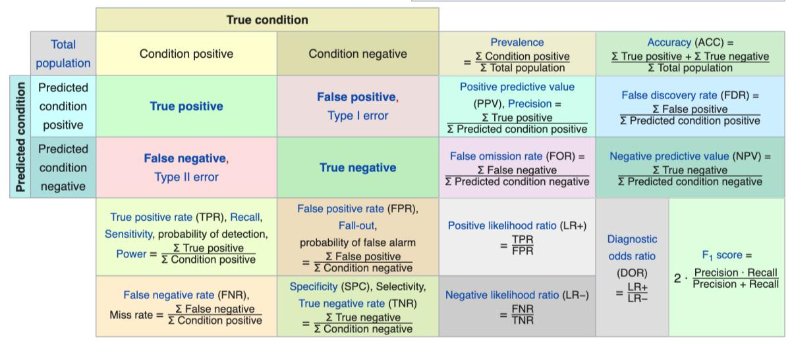

# Week 5 - Exercise 2

**Confusion matrix tutorial**

A confusion matrix is often used to show the performance of a diagnostic tool or
a machine learning algorithm. The machine learning algorithm is typically a
binary classification algorithm. For example, in healthcare, the algorithm could
output if the patient has a disease or does not have the disease (hence binary –
having one of two outcomes).

Suppose you developed a logistic regression algorithm to classify if a patient
has a disease or does not. After testing the algorithm on a test set, you get
the following confusion matrix:

Use the reference confusion matrix enclosed to answer the following questions
and calculate the metrics:

1.  How many true positives are displayed in the confusion matrix?

--------------------------------------------------------------------------------

1.  How many true negatives are displayed in the confusion matrix?

--------------------------------------------------------------------------------

1.  What is the overall accuracy of the algorithm?

--------------------------------------------------------------------------------

1.  What is the sensitivity of the algorithm?

--------------------------------------------------------------------------------

1.  What is the specificity of the algorithm?

--------------------------------------------------------------------------------

1.  What is the F1 score?

--------------------------------------------------------------------------------

1.  How many type 1 errors are made?

--------------------------------------------------------------------------------

Note: Accuracy is not a good measure of performance as it is influenced by the %
of disease prevalence whereas sensitivity and specificity are not dependent on
disease prevalence.

<https://en.wikipedia.org/wiki/Confusion_matrix>



Answers: A: 102 B: 150 C: 0.8904594 D: 0.8225806 E: 0.9433962 F: 0.8680854 G: 9

I'll help you solve this problem step by step, explaining the formulas and also
showing how you could calculate these metrics in R.

First, let's organize the confusion matrix properly:

```         
                            | Predicted: Has disease | Predicted: Does not have disease
---------------------------|------------------------|------------------------------
Actual: Has disease        | 102 (TP)               | 9 (FN)
Actual: Does not have disease | 22 (FP)             | 150 (TN)
```

Now, let's calculate each metric:

## A) How many true positives are displayed in the confusion matrix?

True positives (TP) are cases where the model correctly predicted the patient
has the disease. **TP = 102**

## B) How many true negatives are displayed in the confusion matrix?

True negatives (TN) are cases where the model correctly predicted the patient
does not have the disease. **TN = 150**

## C) What is the overall accuracy of the algorithm?

Accuracy = (TP + TN) / (TP + TN + FP + FN) Accuracy = (102 + 150) / (102 + 150 +
22 + 9) Accuracy = 252 / 283 Accuracy ≈ 0.8905 or 89.05%

## D) What is the sensitivity of the algorithm?

Sensitivity (Recall) = TP / (TP + FN) Sensitivity = 102 / (102 + 9) Sensitivity
= 102 / 111 Sensitivity ≈ 0.9189 or 91.89%

## E) What is the specificity of the algorithm?

Specificity = TN / (TN + FP) Specificity = 150 / (150 + 22) Specificity = 150 /
172 Specificity ≈ 0.8721 or 87.21%

## F) What is the F1 score?

F1 score = 2 \* (Precision \* Recall) / (Precision + Recall)

First, we need to calculate Precision: Precision = TP / (TP + FP) Precision =
102 / (102 + 22) Precision = 102 / 124 Precision ≈ 0.8226

Now, using Recall (Sensitivity) from above: F1 score = 2 \* (0.8226 \* 0.9189) /
(0.8226 + 0.9189) F1 score = 2 \* 0.7559 / 1.7415 F1 score ≈ 0.8679 or 86.79%

## G) How many type 1 errors are made?

Type 1 errors are false positives (FP), meaning the model incorrectly predicted
the patient has the disease when they don't. **FP = 22**

## Calculating these metrics in R

Here's how you could calculate these metrics in R:

```{r}
# Create the confusion matrix
conf_matrix <- matrix(c(102, 9, 22, 150), nrow = 2, byrow = TRUE)
colnames(conf_matrix) <- c("Predicted: Has disease", "Predicted: Does not have disease")
rownames(conf_matrix) <- c("Actual: Has disease", "Actual: Does not have disease")

# View the confusion matrix
conf_matrix

# Extract values
TP <- conf_matrix[1, 1]  # 102
FN <- conf_matrix[1, 2]  # 9
FP <- conf_matrix[2, 1]  # 22
TN <- conf_matrix[2, 2]  # 150

# Calculate metrics
accuracy <- (TP + TN) / (TP + TN + FP + FN)
sensitivity <- TP / (TP + FN)
specificity <- TN / (TN + FP)
precision <- TP / (TP + FP)
f1_score <- 2 * (precision * sensitivity) / (precision + sensitivity)
type1_errors <- FP

# Print results
cat("True Positives:", TP, "\n")
cat("True Negatives:", TN, "\n")
cat("Accuracy:", round(accuracy, 4), "\n")
cat("Sensitivity:", round(sensitivity, 4), "\n")
cat("Specificity:", round(specificity, 4), "\n")
cat("F1 Score:", round(f1_score, 4), "\n")
cat("Type 1 Errors:", type1_errors, "\n")

```

## CARET PACKAGE

```{r}
library(caret)

# First, create the raw 2x2 matrix with the values
raw_matrix <- matrix(c(102, 9, 22, 150), nrow = 2, byrow = TRUE)

# Convert to a table with proper factor levels
actual <- factor(c(rep("Has disease", 102+22), rep("Does not have disease", 9+150)))
predicted <- factor(c(rep("Has disease", 102), rep("Does not have disease", 22), 
                     rep("Has disease", 9), rep("Does not have disease", 150)))

# Create the confusion matrix using the factors
conf_table <- table(predicted, actual)

# Now use confusionMatrix
cm <- confusionMatrix(conf_table, positive = "Has disease")
print(cm)

```
